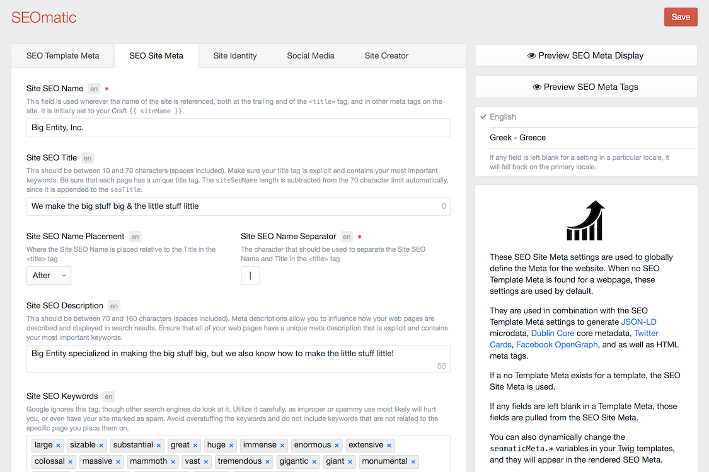
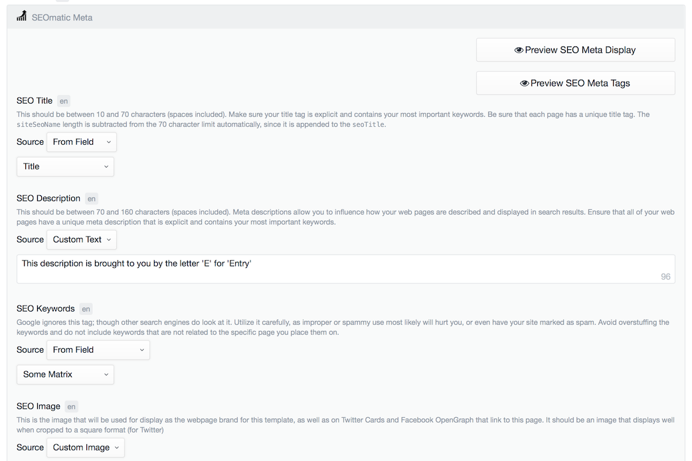
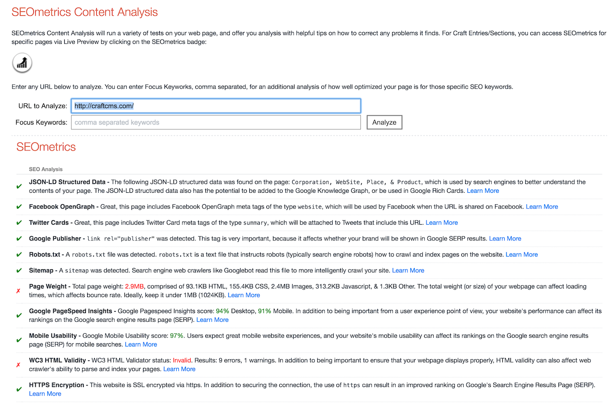
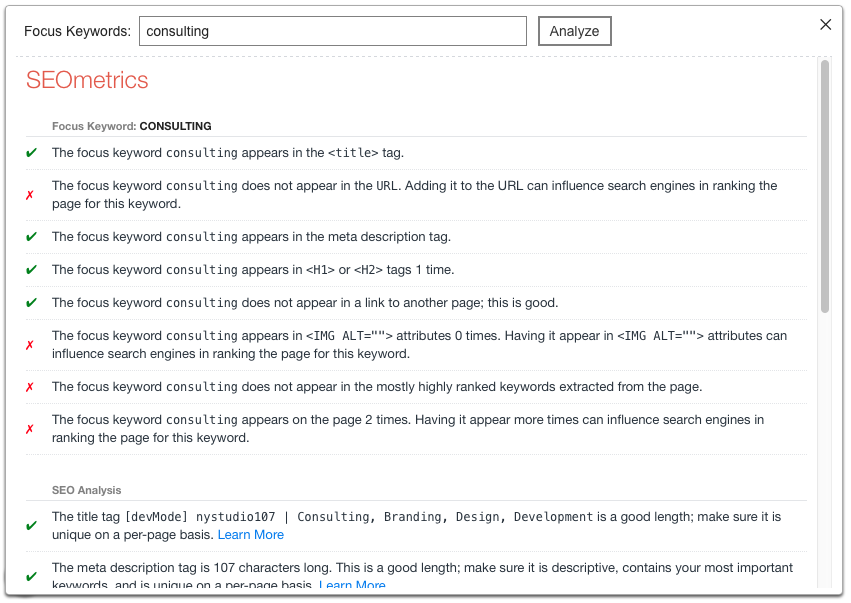
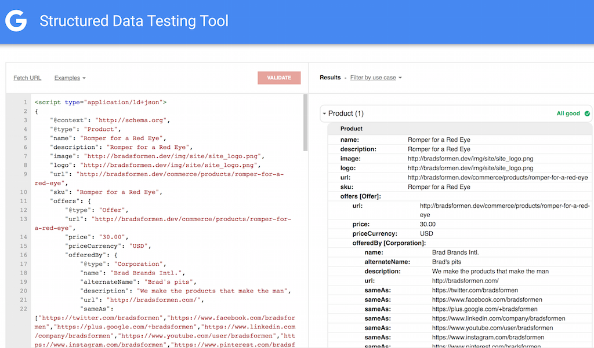
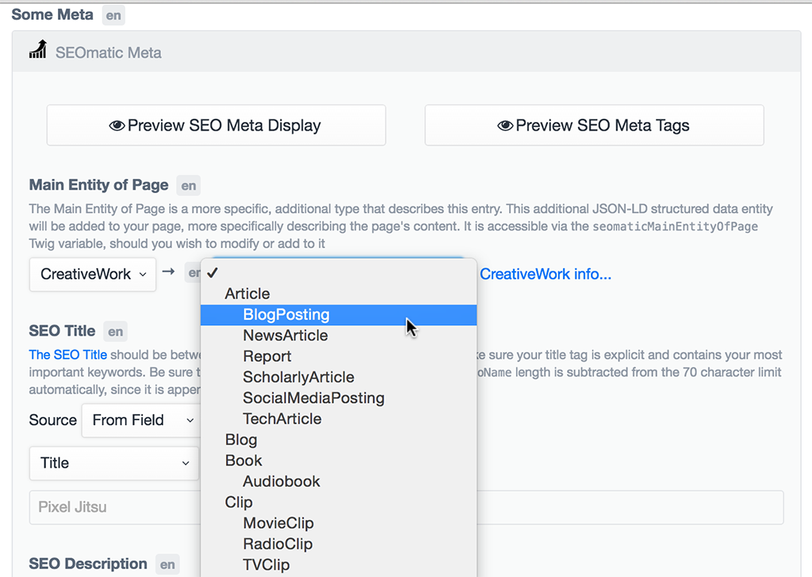
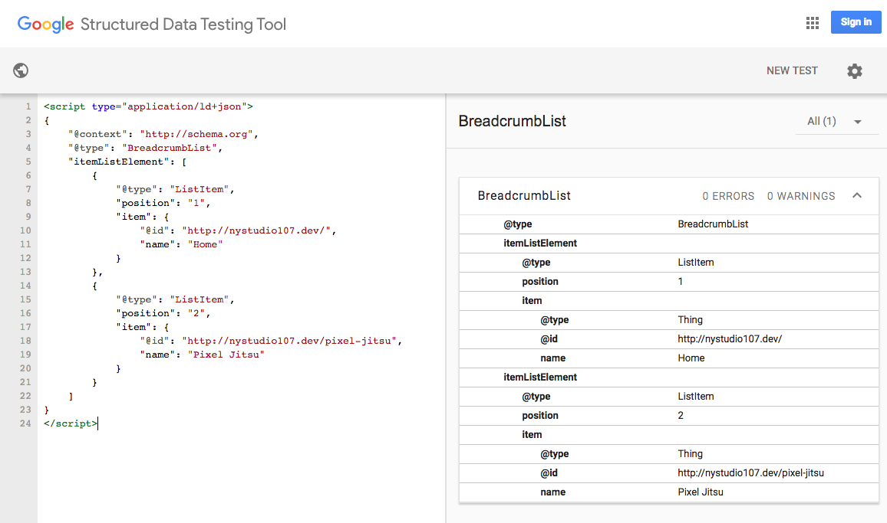
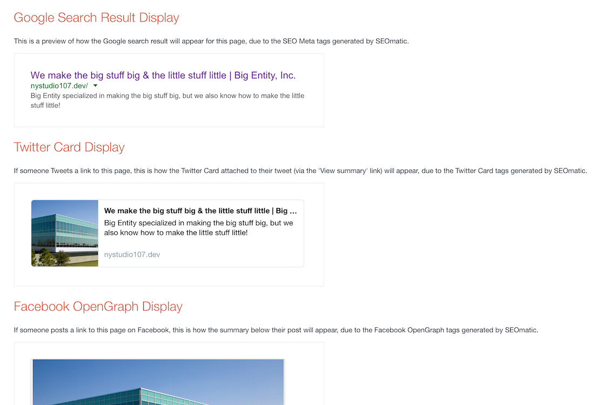

# SEOmatic plugin for Craft

A turnkey SEO implementation for Craft CMS that is comprehensive, powerful, and flexible.



## Installation

To install SEOmatic, follow these steps:

1. Download & unzip the file and place the `seomatic` directory into your `craft/plugins` directory
2.  -OR- do a `git clone https://github.com/nystudio107/seomatic.git` directly into your `craft/plugins` folder.  You can then update it with `git pull`
3.  -OR- install with Composer via `composer require nystudio107/seomatic`
4. Install plugin in the Craft Control Panel under Settings > Plugins
5. The plugin folder should be named `seomatic` for Craft to see it.  GitHub recently started appending `-master` (the branch name) to the name of the folder for zip file downloads.

SEOmatic works on Craft 2.4.x, Craft 2.5.x, and Craft 2.6.x.

## Overview

### Video overview of SEOmatic:

[](https://www.youtube.com/watch?v=f1149YVEF_0)

SEOmatic allows you to quickly get a website up and running with a robust, comprehensive SEO strategy.  It is also implemented in a Craft-y way, in that it is also flexible and customizable.  The SEOmetrics feature scans your content for focus keywords, and offers analysis on how to improve your SEO.

It implements [JSON-LD](https://developers.google.com/schemas/formats/json-ld?hl=en) microdata, [Dublin Core](http://dublincore.org) core metadata, [Twitter Cards](https://dev.twitter.com/cards/overview) tags, [Facebook OpenGraph](https://developers.facebook.com/docs/sharing/opengraph) tags, [Humans.txt](http://humanstxt.org) authorship accreditation, and as well as HTML meta tags.

To better understand how all of this metadata benefits your website, please read: [Promote Your Content with Structured Data Markup](https://developers.google.com/structured-data/)

The general philosophy is that SEO Site Meta can be overridden by SEO Template Meta, which can be overridden by SEO Entry Meta, which can be overridden by dynamic SEO Twig tags.

In this way, the SEO Meta tags on your site cascade, so that they are globally available, but also can be customized in a very granular way.

SEOmatic populates your templates with SEO Meta in the same way that Craft populates your templates with `entry` variables, with a similar level of freedom and flexibility in terms of how you utilize them.

SEOmatic also caches each unique SEO Meta request so that your website performance is minimally impacted by the rich SEO Meta tags provided.

## Rendering your SEO Meta tags

All you need to do in order to output the SEOmatic SEO Meta tags is in the `<head>` tag of your main `layout.twig` (or whatever template all of your other templates `extends`), place this tag:

    

That's it.  It'll render all of that SEO goodness for you.

SEOmatic uses its own internal template for rendering; but you can provide it with one of your own as well, just use this Twig code instead:

     

...and it'll use your custom template instead.

If the [Minify](https://github.com/nystudio107/minify) plugin is installed, SEOmatic will minify the SEO Meta tags & JSON-LD.

## Configuring SEOmatic

When you first install SEOmatic you'll see a welcome screen, click on the **Get Started** to, well, get started configuring SEOmatic.

All of the SEOmatic settings are fully localizable, so you can have SEO in as many languages as your website supports.  If any field is left blank for a setting in a particular locale, it will fall back on the primary locale.

### SEO Site Meta

These SEO Site Meta settings are used to globally define the Meta for the website.  When no SEO Template Meta is found for a webpage, these settings are used by default.

They are used in combination with the SEO Template Meta settings to generate [JSON-LD](https://developers.google.com/schemas/formats/json-ld?hl=en) microdata, [Dublin Core](http://dublincore.org) core metadata, [Twitter Cards](https://dev.twitter.com/cards/overview), [Facebook OpenGraph](https://developers.facebook.com/docs/sharing/opengraph), and as well as HTML meta tags.

If no Template Meta exists for a template, the SEO Site Meta is used.

If any fields are left blank in a Template Meta, those fields are pulled from the SEO Site Meta.

You can also dynamically change any of these SEO Meta fields in your Twig templates, and they will appear in the rendered SEO Meta.

* **Site SEO Name** - This field is used wherever the name of the site is referenced, both at the trailing end of the `<title>` tag, and in other meta tags on the site. It is initially set to your Craft `{{ siteName }}`.
* **Site SEO Title** - This should be between 10 and 70 characters (spaces included). Make sure your title tag is explicit and contains your most important keywords. Be sure that each page has a unique title tag.
* **Site SEO Name Placement** - Where the Site SEO Name is placed relative to the Title in the `<title>` tag
* **Site SEO Name Separator** - The character that should be used to separate the Site SEO Name and Title in the `<title>` tag
* **Site SEO Description** - This should be between 70 and 160 characters (spaces included). Meta descriptions allow you to influence how your web pages are described and displayed in search results. Ensure that all of your web pages have a unique meta description that is explicit and contains your most important keywords.
* **Site SEO Keywords** - Google ignores this tag; though other search engines do look at it. Utilize it carefully, as improper or spammy use most likely will hurt you, or even have your site marked as spam. Avoid overstuffing the keywords and do not include keywords that are not related to the specific page you place them on.
* **Site SEO Image** - This is the image that will be used for display as the global website brand, as well as on Twitter Cards and Facebook OpenGraph that link to the website, if they are not specified. The image must be in JPG, PNG, or GIF format.
* **Site SEO Image Transform** - The image transform to apply to the Site SEO Image.
* **Site Twitter Card Type** - With Twitter Cards, you can attach rich photos and information to Tweets that drive traffic to your website. Users who Tweet links to your content will have a “Card” added to the Tweet that’s visible to all of their followers.
* **Site Twitter Card Image** - This is the image that will be used for display on Twitter Cards in tweets that link to the website. If no image is specified here, the Site SEO Image will be used for Twitter Cards instead. The image must be in JPG, PNG, or GIF format.
* **Site Twitter Card Image Transform** - The image transform to apply to the Twitter SEO Image. Twitter recommends: 120 x 120 pixels minimum size, 1:1 aspect ratio, 1mb max size for Summary Card images, and 280x150 pixels minimum size, 1.86:1 aspect ratio, 1mb max size for Summary Card with Large Image images.
* **Site Facebook OpenGraph Type** - Adding OpenGraph tags to your website influences the performance of your links on social media by allowing you to control what appears when a user posts a link to your content on Facebook.
* **Site Facebook OpenGraph Image** - This is the image that will be used for display on Facebook posts that link to the website. If no image is specified here, the Site SEO Image will be used for Facebook posts instead. The image must be in JPG, PNG, or GIF format.
* **Site Facebook OpenGraph Image Transform** - The image transform to apply to the Facebook SEO Image. Facebook recommends: 1200 x 630 pixels minimum size, 1.9:1 aspect ratio, 8mb max size.
* **Site Robots** - The [robots meta tag](https://developers.google.com/webmasters/control-crawl-index/docs/robots_meta_tag?hl=en) lets you utilize a granular, page-specific approach to controlling how an individual page should be indexed and served to users in search results.  Setting it to a blank value means 'no change'.

#### SiteLinks Search Box

With [Google Sitelinks search box](https://developers.google.com/structured-data/slsb-overview), from search results. Search users sometimes use navigational queries, typing in the brand name or URL of a known site or app, only to do a more detailed search once they reach their destination.

* **Search Targets** - This property specifies a search URL pattern for sending queries to your site's search engine. It must include a string enclosed in curly braces that is a placeholder for the user's search query (e.g., `{search_term_string}`). The string inside the curly braces must also appear in the name attribute of the query-input property.
* **Search Query Input** - The value for the name attribute of query-input must match the string enclosed inside curly braces in the target property of potentialAction, e.g.: `searchtermstring`

#### robots.txt

* **robots.txt Template** - A `robots.txt` file is a file at the root of your site that indicates those parts of your site you don’t want accessed by search engine crawlers. The file uses the [Robots Exclusion Standard](http://en.wikipedia.org/wiki/Robots_exclusion_standard#About_the_standard), which is a protocol with a small set of commands that can be used to indicate access to your site by section and by specific kinds of web crawlers (such as mobile crawlers vs desktop crawlers).

SEOmatic automatically handles requests for `/robots.txt`. For this to work, make sure that you do not have an actual `robots.txt` file in your `public/` folder (because that will take precedence).

If you are running Nginx, make sure that you don't have a line like:

    location = /robots.txt  { access_log off; log_not_found off; }

...in your config file.  A directive like this will prevent SEOmatic from being able to service the request for `/robots.txt`.  If you do have a line like this in your config file, just comment it out, and restart Nginx with `sudo nginx -s reload`.

The **Preview Robots.txt** button lets you preview what your rendered robots.txt file will look like.

You can use any Craft `environmentVariables` in these fields in addition to static text, e.g.:

    This is my {baseUrl}

### Site Identity

These Site Identity settings are used to globally define the identity and ownership of the website.

They are used in combination with the SEO Template Meta settings to generate [JSON-LD](https://developers.google.com/schemas/formats/json-ld?hl=en) microdata, [Dublin Core](http://dublincore.org) core metadata, [Twitter Cards](https://dev.twitter.com/cards/overview), [Facebook OpenGraph](https://developers.facebook.com/docs/sharing/opengraph), and as well as HTML meta tags.

The Site Owner type determines the JSON-LD schema that will be used to identity the website to search engines.

Leave any fields blank that aren't applicable or which you do not want as part of the SEO schema.

#### Site Ownership
* **Google Site Verification** - For the `<meta name='google-site-verification'>` tag. Only enter the code in the `content=''`, not the entire tag. [Here's how to get it.](https://www.google.com/webmasters/verification/).
* **Bing Site Verification** - For the `<meta name='msvalidate.01'>` tag. Only enter the code in the `content=''`, not the entire tag. [Here's how to get it.](https://www.bing.com/webmaster/help/how-to-verify-ownership-of-your-site-afcfefc6).
* **Google Tag Manager ID** - If you enter your Google Tag Manager ID here, the Google Tag Manager script tags will be included in your `<head>` (the script is not included during Live Preview). Only enter the ID, e.g.: `GTM-XXXXXX`, not the entire script code. [Here's how to get it.](https://support.google.com/tagmanager/answer/6102821?hl=en)
* **Google Analytics Tracking ID** - If you enter your Google Analytics Tracking ID here, the Google Analytics script tags will be included in your `<head>` (the script is not included if `devMode` is on or during Live Preview). Only enter the ID, e.g.: `UA-XXXXXX-XX`, not the entire script code. [Here's how to get it.](https://support.google.com/analytics/answer/1032385?hl=en)
* **Automatically send Google Analytics PageView** - Controls whether the Google Analytics script automatically sends a PageView to Google Analytics when your pages are loaded
* **Google Analytics Plugins** - Select which Google Analytics plugins to enable. [Learn More](https://developers.google.com/analytics/devguides/collection/analyticsjs/)
* **Site Owner Entity Type** - The type of entity that owns this website.  Choose as general or specific of a type as you like.  Any entity sub-type left blank is ignored.

More fields will also appear depending on the selected **Site Owner Entity Type**.  For instance, any `LocalBusiness` sub-type will receive a field for **Opening Hours**, so that the hours that the business is open will be rendered in the Identity and Place JSON-LD microdata.

##### Google Tag Manager

Note that the Google Tag Manager implementation supports the `dataLayer` property.  You can set it like any other Twig array:

	

You can set the `dataLayer` Twig variable either in your templates that extend your `layout.twig` or in your `layout.twig` itself.  The usual rules on Twig variable scoping apply, you just need to set the `dataLayer` array before the `` is called.  [Learn More](https://developers.google.com/tag-manager/devguide)

There is also a `gtmDataLayerVariableName` variable in `config.php` which allows you to control the name of the Javascript `dataLayer` variable.

#### General Info
* **Entity Name** - The name of the entity that owns the website
* **Alternate Entity Name** - An alternate or nickname for the entity that owns the website
* **Entity Description** - A description of the entity that owns the website
* **Entity URL** - A URL for the entity that owns the website
* **Entity Brand** - An image or logo that represents the entity that owns the website.  The image must be in JPG, PNG, or GIF format.
* **Entity Telephone** - The primary contact telephone number for the entity that owns the website
* **Entity Email** - The primary contact email address for the entity that owns the website

#### Location Info
* **Entity Latitude** - The latitude of the location of the entity that owns the website, e.g.: -120.5436367
* **Entity Longitude** - The longitude of the location of the entity that owns the website, e.g.: 80.6033588
* **Entity Street Address** - The street address of the entity that owns the website, e.g.: 123 Main Street
* **Entity Locality** - The locality of the entity that owns the website, e.g.: Portchester
* **Entity Region** - The region of the entity that owns the website, e.g.: New York or NY
* **Entity Postal Code** - The postal code of the entity that owns the website, e.g.: 14580
* **Entity Country** - The country in which the entity that owns the website is located, e.g.: US

#### Organization Info
* **Organization DUNS Number** - The DUNS (Dun & Bradstreet) number of the organization/company/restaurant that owns the website
* **Organization Founder** - The name of the founder of the organization/company/restaurant
* **Organization Founding Date** - The date the organization/company/restaurant was founded
* **Organization Founding Location** - The location where the organization/company/restaurant was founded
* **Organization Contact Points** - Use [organization contact points](https://developers.google.com/structured-data/customize/contact-points) to add your organizations's contact information to the Google Knowledge panel in some searches. The Telephone Number must be an internationalized version of the phone number, starting with the '+' symbol and country code (+1 in the US and Canada). e.g.: +1-800-555-1212 or +44-2078225951

#### Local Business Info
* **Opening Hours** - The opening hours for this local business. If the business is closed on a given day, just leave the hours for that day blank.

#### Corporation Info
* **Corporation Ticker Symbol** - The exchange ticker symbol of the corporation

#### Food Establishment Info
* **Food Establishment Cuisine** - The primary type of cuisine that the food establishment serves
* **Food Establishment Menu URL** - URL to the food establishment's menu
* **Food Establishment Reservations URL** - URL to the food establishment's reservations page

#### Person Info
* **Person Gender** - The gender of the person
* **Person Birth Place** - The place where the person was born

You can use any Craft `environmentVariables` in these fields in addition to static text, e.g.:

    This is my {baseUrl}

### Social Media

These Social Media settings are used to globally define the social media accounts associated with your website.

They are used in combination with the SEO Template Meta settings to generate [JSON-LD](https://developers.google.com/schemas/formats/json-ld?hl=en) microdata, [Dublin Core](http://dublincore.org) core metadata, [Twitter Cards](https://dev.twitter.com/cards/overview), [Facebook OpenGraph](https://developers.facebook.com/docs/sharing/opengraph), and as well as HTML meta tags.

None of these fields are mandatory; if you don't have a given social media account, just leave it blank.

* **Twitter Handle** - Your Twitter Handle, without the preceding @
* **Facebook Handle** - Your Facebook company/fan page handle (the part after `https://www.Facebook.com/`
* **Facebook Profile ID** - Your Facebook Profile/Page ID. Click on the 'About' tab on your Facebook company/fan page, click on 'Page Info', then scroll to the bottom to find your 'Facebook Page ID'
* **Facebook App ID** - Your Facebook App ID.  Providing a Facebook Application ID for use with the Social Media Sharing feature is recommended, but optional. [Learn More](https://developers.facebook.com/docs/apps/register)
* **LinkedIn Handle** - Your LinkedIn page handle (the part after `https://www.linkedin.com/in/` or `https://www.linkedin.com/company/`)
* **Google+ Handle** - Your Google+ page handle, without the preceding +. If you have a numeric Google+ account still, just enter that.
* **YouTube User Handle** - Your YouTube handle (the part after `https://www.youtube.com/user/`)
* **YouTube Channel Handle** - Your YouTube handle (the part after `https://www.youtube.com/c/`)
* **Instagram Handle** - Your Instagram handle
* **Pinterest Handle** - Your Pinterest page handle (the part after `https://www.pinterest.com/`)
* **Github Handle** - Your Github page handle (the part after `https://github.com/`)

You must have a **Twitter Handle** for SEOmatic to generate Twitter Card tags for you.  Similarly, you should have a **Facebook Profile ID** for the Facebook Open Graph tags, but it's not required.

You can use any Craft `environmentVariables` in these fields in addition to static text, e.g.:

    This is my {baseUrl}

### Site Creator

These Site Creator settings are used to globally define & attribute the creator of the website.  The creator is the company/individual that developed the website.

They are used in combination with the SEO Template Meta settings to generate [JSON-LD](https://developers.google.com/schemas/formats/json-ld?hl=en) microdata, [Dublin Core](http://dublincore.org) core metadata, [Twitter Cards](https://dev.twitter.com/cards/overview), [Facebook OpenGraph](https://developers.facebook.com/docs/sharing/opengraph), and as well as HTML meta tags.

The Site Creator information is referenced in the Identity JSON-LD schema that is used to identity the website to search engines.

Leave any fields blank that aren't applicable or which you do not want as part of the SEO schema.

#### Site Creator
* **Site Creator Entity Type** - The type of entity that created this website.

#### General Info
* **Entity Name** - The name of the entity that created the website
* **Alternate Entity Name** - An alternate or nickname for the entity that created the website
* **Entity Description** - A description of the entity that created the website
* **Entity URL** - A URL for the entity that created the website
* **Entity Brand** - An image or logo that represents the entity that created the website.  The image must be in JPG, PNG, or GIF format.
* **Entity Telephone** - The primary contact telephone number for the entity that created the website
* **Entity Email** - The primary contact email address for the entity that created the website

#### Location Info
* **Entity Latitude** - The latitude of the location of the entity that created the website, e.g.: -120.5436367
* **Entity Longitude** - The longitude of the location of the entity that created the website, e.g.: 80.6033588
* **Entity Street Address** - The street address of the entity that created the website, e.g.: 575 Dunfrey Road
* **Entity Locality** - The locality of the entity that created the website, e.g.: Lansing
* **Entity Region** - The region of the entity that created the website, e.g.: Michigan or MI
* **Entity Postal Code** - The postal code of the entity that created the website, e.g.: 11360
* **Entity Country** - The country in which the entity that created the website is located, e.g.: US

#### Organization Info
* **Organization DUNS Number** - The DUNS (Dun & Bradstreet) number of the organization/company/restaurant that created the website
* **Organization Founder** - The name of the founder of the organization/company
* **Organization Founding Date** - The date the organization/company was founded
* **Organization Founding Location** - The location where the organization/company was founded
* **Organization Contact Points** - Use [organization contact points](https://developers.google.com/structured-data/customize/contact-points) to add your organizations's contact information to the Google Knowledge panel in some searches. The Telephone Number must be an internationalized version of the phone number, starting with the '+' symbol and country code (+1 in the US and Canada). e.g.: +1-800-555-1212 or +44-2078225951

#### Corporation Info
* **Corporation Ticker Symbol** - The exchange ticker symbol of the corporation

#### Person Info
* **Person Gender** - The gender of the person
* **Person Birth Place** - The place where the person was born

#### Humans.txt
* **Humans.txt Template** - [Humans.txt](http://humanstxt.org) is an initiative for knowing the people behind a website. It's a TXT file that contains information about the different people who have contributed to building the website. This is the template used to render it; you have access to all of the SEOmatic variables.  This is the template used to render it; you have access to all of the SEOmatic variables.

The **Preview Humans.txt** button lets you preview what your rendered Humans.txt file will look like.

You can use any Craft `environmentVariables` in these fields in addition to static text, e.g.:

    This is my {baseUrl}

### SEO Template Meta

This list of Template Metas will initially be empty; click on the **New Template Meta** button to create one.

These SEO Meta settings are used to render the SEO Meta for your website. You can create any number of SEO Template Metas associated with your Twig templates on your website.

They are used in combination with the SEO Template Meta settings to generate [JSON-LD](https://developers.google.com/schemas/formats/json-ld?hl=en) microdata, [Dublin Core](http://dublincore.org) core metadata, [Twitter Cards](https://dev.twitter.com/cards/overview), [Facebook OpenGraph](https://developers.facebook.com/docs/sharing/opengraph), and as well as HTML meta tags.

If no Template Meta exists for a template, the SEO Site Meta is used.

If any fields are left blank in a Template Meta, those fields are pulled from the SEO Site Meta.

You can also dynamically change any of these SEO Meta fields in your Twig templates, and they will appear in the rendered SEO Meta.

* **Title** - The human readable title for this SEO Template Meta
* **Template Path** - Enter the path to the template to associate this meta with (just as you would on the Section settings). It will override the SEO Site Meta for this template. Leave any field blank if you want it to fall back on the default global settings for that field.
* **Main Entity of Page** - The Main Entity of Page is a more specific, additional type that describes this page.  This additional JSON-LD structured data entity will be added to your page, more specifically describing the page's content.  It is accessible via the `seomaticMainEntityOfPage` Twig variable, should you wish to modify or add to it
* **SEO Title** - This should be between 10 and 70 characters (spaces included). Make sure your title tag is explicit and contains your most important keywords. Be sure that each page has a unique title tag.
* **SEO Description** - This should be between 70 and 160 characters (spaces included). Meta descriptions allow you to influence how your web pages are described and displayed in search results. Ensure that all of your web pages have a unique meta description that is explicit and contains your most important keywords.
* **SEO Keywords** - Google ignores this tag; though other search engines do look at it. Utilize it carefully, as improper or spammy use most likely will hurt you, or even have your site marked as spam. Avoid overstuffing the keywords and do not include keywords that are not related to the specific page you place them on.
* **SEO Image** - This is the image that will be used for display as the webpage brand for this template, as well as on Twitter Cards and Facebook OpenGraph that link to this page, if they are not specified. The image must be in JPG, PNG, or GIF format.
* **SEO Image Transform** - The image transform to apply to the Site SEO Image.
* **Twitter Card Type** - With Twitter Cards, you can attach rich photos and information to Tweets that drive traffic to your website. Users who Tweet links to your content will have a “Card” added to the Tweet that’s visible to all of their followers.
* **Twitter Card Image** - This is the image that will be used for Twitter Cards that link to this page. If no image is specified here, the Site SEO Image will be used for Twitter Cards instead. The image must be in JPG, PNG, or GIF format.
* **Twitter Card Image Transform** - The image transform to apply to the Twitter Card Image. Twitter recommends: 120 x 120 pixels minimum size, 1:1 aspect ratio, 1mb max size for Summary Card images, and 280x150 pixels minimum size, 1.86:1 aspect ratio, 1mb max size for Summary Card with Large Image images.
* **Facebook OpenGraph Type** - Adding OpenGraph tags to your website influences the performance of your links on social media by allowing you to control what appears when a user posts a link to your content on Facebook.
* **Facebook OpenGraph Image** - This is the image that will be used for Facebook posts that link to this page. If no image is specified here, the Site SEO Image will be used for Facebook posts instead. The image must be in JPG, PNG, or GIF format.
* **Facebook OpenGraph Image Transform** - The image transform to apply to the Facebook OpenGraph Image. Facebook recommends: 1200 x 630 pixels minimum size, 1.9:1 aspect ratio, 8mb max size.
* **Robots** - The [robots meta tag](https://developers.google.com/webmasters/control-crawl-index/docs/robots_meta_tag?hl=en) lets you utilize a granular, page-specific approach to controlling how an individual page should be indexed and served to users in search results.  Setting it to a blank value means 'no change'.

The **SEO Title**, **SEO Description**, and **SEO Keywords** fields can include tags that output entry properties, such as `{title}` or `{myCustomField}` in them.

You can use any Craft `environmentVariables` in these fields in addition to static text, e.g.:

    This is my {baseUrl}

## SEO Entry Meta



SEOmatic provides a FieldType called `SEOmatic Meta` that you can add to your Sections.  It allows you to provide meta information on a per-entry basis.  SEOmatic will automatically override any Site Meta or Tempalate Meta with Entry Meta if an `entry` that has an SEOmatic Meta field is auto-populated by Craft into a template.

This also works with Categories and Craft Commerce Products that have an SEOmatic Meta field attached to them.

If you add an SEOmatic FieldType to an existing Section that already has entries in it, you'll need to re-save the Section to populate the newly added SEOmatic FieldType with data.  You can do this via Settings → Edit My Section → hit Save.

If any fields are left blank in an Entry Meta, those fields are pulled from the SEO Site Meta / SEO Template Meta.

You can also dynamically change any of these SEO Meta fields in your Twig templates, and they will appear in the rendered SEO Meta.

* **Main Entity of Page** - The Main Entity of Page is a more specific, additional type that describes this entry.  This additional JSON-LD structured data entity will be added to your page, more specifically describing the page's content.  It is accessible via the `seomaticMainEntityOfPage` Twig variable, should you wish to modify or add to it.
* **SEO Title** - This should be between 10 and 70 characters (spaces included). Make sure your title tag is explicit and contains your most important keywords. Be sure that each page has a unique title tag.
* **SEO Description** - This should be between 70 and 160 characters (spaces included). Meta descriptions allow you to influence how your web pages are described and displayed in search results. Ensure that all of your web pages have a unique meta description that is explicit and contains your most important keywords.
* **SEO Keywords** - Google ignores this tag; though other search engines do look at it. Utilize it carefully, as improper or spammy use most likely will hurt you, or even have your site marked as spam. Avoid overstuffing the keywords and do not include keywords that are not related to the specific page you place them on.
* **SEO Image** - This is the image that will be used for display as the webpage brand for this entry, as well as on Twitter Cards and Facebook OpenGraph that link to this page, if they are not specified. The image must be in JPG, PNG, or GIF format.
* **Canonical URL Override** - The canonical URL is automatically set to the entry's URL. This allows you to override the canonical URL if you need to; this can be a path or a fully qualified URL. Just leave it blank for the canonical URL to be set automatically.
* **SEO Image Transform** - The image transform to apply to the Site SEO Image.
* **Twitter Card Type** - With Twitter Cards, you can attach rich photos and information to Tweets that drive traffic to your website. Users who Tweet links to your content will have a “Card” added to the Tweet that’s visible to all of their followers.
* **Twitter Card Image** - This is the image that will be used for display on Twitter Cards for tweets that link to this entry. If no image is specified here, the Site SEO Image will be used for Twitter Cards instead. The image must be in JPG, PNG, or GIF format.
* **Twitter Card Image Transform** - The image transform to apply to the Twitter Card Image. Twitter recommends: 120 x 120 pixels minimum size, 1:1 aspect ratio, 1mb max size for Summary Card images, and 280x150 pixels minimum size, 1.86:1 aspect ratio, 1mb max size for Summary Card with Large Image images.
* **Facebook OpenGraph Type** - Adding OpenGraph tags to your website influences the performance of your links on social media by allowing you to control what appears when a user posts a link to your content on Facebook.
* **Facebook OpenGraph Image** - This is the image that will be used for display on Facebook posts that link to this entry. If no image is specified here, the Site SEO Image will be used for Facebook posts instead. The image must be in JPG, PNG, or GIF format.
* **Facebook OpenGraph Image Transform** - The image transform to apply to the Facebook SEO Image. Facebook recommends: 1200 x 630 pixels minimum size, 1.9:1 aspect ratio, 8mb max size.
* **Robots** - The [robots meta tag](https://developers.google.com/webmasters/control-crawl-index/docs/robots_meta_tag?hl=en) lets you utilize a granular, page-specific approach to controlling how an individual page should be indexed and served to users in search results.  Setting it to a blank value means 'no change'.

The **SEO Title**, **SEO Description**, and **SEO Keywords** fields can include tags that output entry properties, such as `{title}` or `{myCustomField}` in them.

You can use any Craft `environmentVariables` in these fields in addition to static text, e.g.:

    This is my {baseUrl}

In addition to being able to hold custom data that you enter manually, you can also set the Source that **SEO Title**, **SEO Description**, **SEO Keywords**, and **SEO Image** SEOmatic Meta fields to pull data from to an existing field in your Entry.  

**SEO Image** only can pull from an existing Assets field, while **SEO Title**, **SEO Description**, and **SEO Keywords** can pull from Text, Rich Text, Tags, and Matrix fields.  If you pull from a Matrix field, SEOmatic goes through and concatenates all of the Text & Rich Text fields together (this is useful for **SEO Keywords** generation).

The **SEO Keywords** field also allows you to extract keywords automatically from an existing field in your Entry via the `Keywords From Field` Source option.

SEOmatic Meta FieldTypes also have default settings that allow you to control what the default settings should be for each meta field, and whether they can be changed by the person editing the entry.

### Entry Meta Properties in your Templates

If you're using an `SEOmatic Meta` FieldType in your entries, you can also access the properties of it in your templates.  This is useful, for instance, if you're iterating through `craft.entries` and want to be able to access the meta properties of each entry in the loop.

Assume that we have an `SEOmatic Meta` FieldType with the handle `seoMeta` in our template, we can do things like:

	
		{{ newsItem.seoMeta.seoTitle }}
		{{ newsItem.seoMeta.seoDescription }}
		{{ newsItem.seoMeta.seoKeywords }}
		{{ newsItem.seoMeta.seoImage }}
	

In addition, you can do:

	

...to get the seoImage's AssetID, and you can also do:

	

...to get the Main Entity of Page JSON-LD array for the entry, which you can then manipulate, or output via SEOmatic's Twig function:

	{{ newsJsonLD | renderJSONLD }}

## SEOmetrics Content Analysis

The SEOmetrics feature in SEOmatic allows you to analyze your pages to measure the effectiveness of the SEO on them.  It can be accessed in two different places, either analyzing arbitrary URLs via the Admin CP, or analyzing specific Entries/Sections via Live Preview.

### SEOmetrics in the Admin CP



SEOmetrics Content Analysis will run a variety of tests on your web page, and offer you analysis with helpful tips on how to correct any problems it finds.  For each test, there is a `Learn More` link that will offer details on the thing being tested.

You can enter any arbitrary URL in the **URL to Analyze** field, even URLs to external websites, should you wish to.

You can enter **Focus Keyworks**, comma separated, for an additional analysis of how well optimized your page is for those specific SEO keywords.

### SEOmetrics during Live Preview



During Live Preview, a small SEOmatic icon is displayed in the lower-left corner of the Live Preview screen.  If you click on it, it will run a variety of tests on your web page, and offer you analysis with helpful tips on how to correct any problems it finds.

You can enter **Focus Keyworks**, comma separated, for an additional analysis of how well optimized your page is for those specific SEO keywords.

### Video SEOmetrics in Action:

[](https://www.youtube.com/watch?v=y7swBbGwEJE)

You can disable this feature by setting `displaySeoMetrics` to `false` in the `config.php`, should you wish to not have it displayed.

SEOmetrics during Live Preview only works if System Status is set to "on".

## Craft Commerce Product Microdata



If an SEOmatic FieldType is attached to a Craft Commerce Product, in addition to rendering the page SEO Meta, it will also generate [Product JSON-LD microdata](https://developers.google.com/structured-data/rich-snippets/products) that describes the product.

It does this by pulling values from the `seomaticMeta` settings from the SEOmatic FieldType, as well as by pulling data from the Craft Commerce Product.  If you have an SEOmatic FieldType attached to a Craft Commerce Product,  `seomaticMainEntityOfPage` array is injected into your page template:

    {% set seomaticMainEntityOfPage = [
        {
            type: "Product",
            name: "Romper for a Red Eye",
            description: "Irresistible to women.  Establishes dominance over men.  Brad's for Men will release your inner beast with its musky essence.",
            image: "http://bradsformen.dev/img/site/site_logo.png",
            logo: "http://bradsformen.dev/img/site/site_logo.png",
            url: "http://bradsformen.dev/commerce/products/romper-for-a-red-eye",
            sku: "Romper for a Red Eye",
            offers: {
                type: "Offer",
                url: "http://bradsformen.dev/commerce/products/romper-for-a-red-eye",
                price: "30.00",
                priceCurrency: "USD",
                offeredBy: seomaticIdenity,
                seller: seomaticIdenity,
            }
        }
    ] %}

Since this is just a Twig array, you can alter it as you see fit, and whatever changes you make will be reflected in the JSON-LD that SEOmatic renders via the ``  Because of the way that Twig handles arrays, you **must** include every field in the array when doing a `set` or `merge`, otherwise the fields you exclude will not exist.

Or if you want to set just one variable in the array, you can use the Twig function [merge](http://twig.sensiolabs.org/doc/filters/merge.html).  Because this is an _array_ of Products, you need to do something like this to add to each Product in the array:

    
        
        
        
            
            
        
        
    

You can change these `seomaticMainEntityOfPage` variables in your templates that `extends` your main `layout.twig` template, and due to the Twig rendering order, when `` is called, they'll be populated in your rendered SEO Meta tags.

See the section **Dynamic Twig SEO Meta** for more information on how to manipulate SEOmatic variables via Twig.

SEOmatic also automatically strips HTML/PHP tags from the variables, and translates HTML entities to ensure that they are properly encoded.

## Main Entity of Page Microdata



SEOmatic will automatically generate [Main Entity of Page](http://www.seoskeptic.com/how-to-use-schema-org-v2-0s-mainentityofpage-property/) JSON-LD microdata for Template and Entry SEO Meta.

The Main Entity of Page is a more specific, additional type of information that describes the page. This additional JSON-LD structured data entity will be added to your page, more specifically describing the page's content. It is accessible via the `seomaticMainEntityOfPage` Twig variable.

If an SEOmatic FieldType is attached to a Craft Commerce Product, SEOmatic will automatically extrapolate information from the Product. Otherwise, you can choose your own Main Entity of Page in the SEOmatic FieldType.

SEOmatic fills in the basic information for whatever schema type you set as the Main Entity of Page, but since this is just a Twig array, you can alter it as you see fit, and whatever changes you make will be reflected in the JSON-LD that SEOmatic renders via the ``  Because of the way that Twig handles arrays, you **must** include every field in the array when doing a `set` or `merge`, otherwise the fields you exclude will not exist.

Here's an example of how you might add a `startDate` to an `Event` schema type:

    
        
        
    

Note that `Event` schema types require `startDate` and `location` to be set, which SEOmatic is unable to automatically fill in for you.  Additionally, you may want to add more information to any of the schema types used for Main Entity of Page to give search engines more information to add to their knowledge graph.

### Gated or Subscription Content

Google recommends the use of JSON-LD Structured Data for [Subscription and paywalled content](https://developers.google.com/search/docs/data-types/paywalled-content). This is strongly encouraged, so that you are not errantly punished for violating Google's [cloaking](https://support.google.com/webmasters/answer/66355) policies or [guidelines](https://support.google.com/webmasters/answer/35769).

Whether your content is available only after a free registration process, or it's available only to people who subscribe to your website, it's recommended that you use this markup to help Google understand your content.

SEOmatic makes it easy to add this to your `MainEntityOfPage` using markup such as this in your Twig template:

```

    

```

Where the `.paywall` class is whatever your CSS selector is for blocking access to your content. If you have more then one, you'd do something like:

```

    

```
For more information, see Googe's support article [Subscription and paywalled content](https://developers.google.com/search/docs/data-types/paywalled-content).
## Breadcrumbs Microdata



SEOmatic will automatically generate [Breadcrumbs](https://developers.google.com/search/docs/data-types/breadcrumbs) JSON-LD microdata that is used by Google to display breadcrumbs on the SERP rich cards.

By default, SEOmatic will generate breadcrumbs automatically for `Home` (the name is configurable via `breadcrumbsHomeName` in `config.json`), and every element (category, entry, product, whatever) that has a URI matches the current URL segments.

### Changing Breadcrumbs

If you want to do your own custom breadcrumbs, you can set them yourself in the `breadcrumbs` array in the `seomaticMeta` variable like this:

	

	

    
        
    

Since this is just a Twig array, you can alter it as you see fit, and whatever changes you make will be reflected in the JSON-LD that SEOmatic renders via the ``  Because of the way that Twig handles arrays, you **must** include every field in the array when doing a `set` or `merge`, otherwise the fields you exclude will not exist.

You can change these `breadcrumbs` variables in your templates that `extends` your main `layout.twig` template, and due to the Twig rendering order, when `` is called, they'll be populated in your rendered SEO Meta tags.

See the section **Dynamic Twig SEO Meta** for more information on how to manipulate SEOmatic variables via Twig.

SEOmatic also automatically strips HTML/PHP tags from the variables, and translates HTML entities to ensure that they are properly encoded.

### Displaying Breadcrumbs on the Frontend

Should you wish to display the breadcrumbs in your front-end templates so that they are visible to the user, you can do that with code like this:

    <ul class="crumbs">
        
            <li class="crumbs"><a href="{{ crumbUrl }}">{{ crumbName }}</a></li>
        
    </ul>

## Dynamic Twig SEO Meta

All this SEO is great, but what if you want to generate dynamic SEO in an Twig template, with custom or specific requirements that the SEOmatic FieldType can't handle?  SEOmatic makes it easy.

SEOmatic populates your templates with the following global variables for SEO Meta:

    seomaticMeta.seoTitle
    seomaticMeta.seoDescription
    seomaticMeta.seoKeywords
    seomaticMeta.seoImage
    seomaticMeta.canonicalUrl

By default, `seomaticMeta.canonicalUrl` is set to `craft.request.url`.

All of the variables are set by a combination of your SEO Site Meta settings, and the SEO Template Meta settings linked to the currently rendered template (if any).  These are the primary SEOmatic variables that you will be manipulating in your templates.

By the time the various SEOmatic variables are populated into your template, SEOmatic has applied all of the cascading meta from your Site Meta, Template Meta, and Entry Meta.  The variables are all set, and will not be manipulated further by SEOmatic, only output.

So you can change the variables as you see fit; but it also means that if you change your `seoImage`, for example, it will not change the `og:image`.  This is so that you can manipulate them independently.

**Important:** Due to the way Twig scoping works, if you `` a template, it's given a copy of the current Twig context (variables, etc.), which means that any changes made there are not propagated back to the parent template.

So for instance if you `` a template that changes some SEOmatic variables, they will **not** be changed in the parent context's scope, so they will not be rendered by SEOmatic.

You'll need to modify the SEOmatic variables in a template that `` the main `layout.twig` template or via Twig `embeds`.

These work like any other Twig variables; you can output them by doing:

    {{ seomaticMeta.seoTitle }}

If you have a **Twitter Handle**, you'll also get variables that are used to generate your Twitter Card tags:

    seomaticMeta.twitter.card
    seomaticMeta.twitter.site
    seomaticMeta.twitter.creator
    seomaticMeta.twitter.title
    seomaticMeta.twitter.description
    seomaticMeta.twitter.image

You'll also get variables that are used to generate your Facebook Open Graph tags:

    seomaticMeta.og.type
    seomaticMeta.og.locale
    seomaticMeta.og.url
    seomaticMeta.og.title
    seomaticMeta.og.description
    seomaticMeta.og.image
    seomaticMeta.og.site_name
    seomaticMeta.og.see_also

When SEOmatic goes to render the `twitter`, `og` and `article` namespace tags, it iterates through the respective arrays, so you can add, remove, or change any of the key-value pairs in the array, and they will be rendered.  Just ensure that the `key` is a valid schema type for the respective meta tags.

You can even do fun things like:

	
    
...and SEOmatic will output 3 `og:image` tags, one for each image in the array.  Because of the way that Twig handles arrays, you **must** include every field in the array when doing a `set` or `merge`, otherwise the fields you exclude will not exist.

You can also change them all at once like this using the Twig [set](http://twig.sensiolabs.org/doc/tags/set.html) syntax:

	{% set seomaticMeta = { 
	    seoTitle: "Some Title",
	    seoDescription: entry.summary,
	    seoKeywords: "Some,Key,Words",
	    seoImage: seomaticMeta.seoImage,
	    canonicalUrl: entry.url,
	    twitter: { 
	        card: seomaticMeta.twitter.card,
	        site: seomaticMeta.twitter.site,
	        creator: seomaticMeta.twitter.creator,
	        title: "Some Title",
	        description: entry.summary,
	        image: seomaticMeta.twitter.image
	    },
	    og: { 
	        type: seomaticMeta.og.type,
	        locale: seomaticMeta.og.locale,
	        url: entry.url,
	        title: "Some Title",
	        description: entry.summary,
	        image: seomaticMeta.og.image,
	        site_name: seomaticMeta.og.site_name,
	        see_also: seomaticMeta.og.see_also
	    }
	} %}

Anywhere we are setting a field to `seomaticMeta.*`, we're setting it to what it already is, essentially saying to leave it unchanged.  We do this because Twig requires that you pass in the entire array to the `set` operator.

If you're using the `article` OpenGraph type, you'll see an additional `article` namespace array in your `seomaticMeta`:

	{% set seomaticMeta = { 
	    seoTitle: "Some Title",
	    seoDescription: entry.summary,
	    seoKeywords: "Some,Key,Words",
	    seoImage: seomaticMeta.seoImage,
	    canonicalUrl: entry.url,
	    twitter: { 
	        card: seomaticMeta.twitter.card,
	        site: seomaticMeta.twitter.site,
	        creator: seomaticMeta.twitter.creator,
	        title: "Some Title",
	        description: entry.summary,
	        image: seomaticMeta.twitter.image
	    },
	    og: { 
	        type: seomaticMeta.og.type,
	        locale: seomaticMeta.og.locale,
	        url: entry.url,
	        title: "Some Title",
	        description: entry.summary,
	        image: seomaticMeta.og.image,
	        site_name: seomaticMeta.og.site_name,
	        see_also: seomaticMeta.og.see_also
	    },
	    article: { 
	        author: "Some Author",
	        publisher: "Some publisher",
	        tag: "some,tags"
	    }
	} %}


Or if you want to set just one variable in the array, you can use the Twig function [merge](http://twig.sensiolabs.org/doc/filters/merge.html):

    

Here's an example of how to change just the `image` in Twitter:

	
	
	

...and here's an example of how to change just the `image` in OpenGraph:

	
	
	

You can change these `seomaticMeta` variables in your templates that `extends` your main `layout.twig` template, and due to the Twig rendering order, when `` is called, they'll be populated in your rendered SEO Meta tags.

Some of the `seomaticMeta` variables have character limitations on them, because search engines want to see only the most relevant, succinct information, and will truncate them during processing:

* **seomaticMeta.seoTitle** - 70 characters
* **seomaticMeta.seoDescription** - 160 characters
* **seomaticMeta.seoKeywords** - 200 characters

SEOmatic will automatically truncate these variables for you when you set them, so you don't have to worry about the length.  It intelligently truncates them on whole-word boundaries, so nothing will get cut off.

SEOmatic also automatically strips HTML/PHP tags from the variables, and translates HTML entities to ensure that they are properly encoded.

## Rendering Custom JSON LD Microdata

SEOmatic gives you the ability to render an arbitrary [JSON-LD](https://developers.google.com/schemas/formats/json-ld?hl=en) object, passed in as an array().  All three of these methods accomplish the same thing:

	{# Render arbitrary JSON-LD using the 'renderJSONLD' function #}
    {{ renderJSONLD( JSONLD_ARRAY ) }}
    
    {# Render arbitrary JSON-LD using the 'renderJSONLD' filter #}
    {{ JSONLD_ARRAY | renderJSONLD }}
    
    {# Render arbitrary JSON-LD using the 'renderJSONLD' variable #}
    


The JSONLD_ARRAY should be in the following format in PHP:
    
    $myJSONLD = array(
	    "type" => "Corporation",
	    "name" => "nystudio107",
	    "sameAs" => ["https://Twitter.com/nystudio107","https://plus.google.com/+nystudio107"],
	    "address" => array(
		    "type" => 'PostalAddress',
		    "addressCountry" => "US",
		    ),
	    );
	
The JSONLD_ARRAY should be in the following format in Twig:

	
	
The above arrays will render to the following JSON-LD:

	<script type="application/ld+json">
	{
	    "@context": "http://schema.org",
	    "@type": "Corporation",
	    "name": "nystudio107",
	    "sameAs": ["https://Twitter.com/nystudio107","https://plus.google.com/+nystudio107"],
	    "address": {
	        "@type": "PostalAddress",
	        "addressCountry": "US" 
	    } 
	}
	</script>
	
The array can be nested arbitrarily deep with sub-arrays.  The first key in the array, and in each sub-array, should be an "type" with a valid [Schema.org](http://Schema.org) type as the value.  Because Twig doesn't support array keys with non-alphanumeric characters, SEOmatic transforms the keys "type" into "@type" at render time.

Here's a practical example.  Let's say you're working on a spiffy new online store using Craft Commerce, and you want to add in some microdata for the products listed in your store, for SEO purposes.  You can do something like this:

	{% set myJSONLD = {
		type: "Product",
		name: "Brad's for Men Cologne",
		image: "http://bradsformen.com/cologne.png",
		logo: "http://bradsformen.com/cologne_logo.png",
		description: "Brad Bell's musky essence will intoxicate you.",
		model: "XQJ-37",
		offers: {
			type: "Offer",
			url: "http://bradsformen.com/cologne",
			price: "69.99",
			priceCurrency: "USD",
			acceptedPaymentMethod: ["CreditCard", "PayPal"],
			seller: {
			    type: "Corporation",
			    name: "Brad Brands Intl.",
			    url: "http://bradsformen.com"
			}
		},
		manufacturer: {
		    type: "Organization",
		    name: "Scents Unlimited",
		    url: "http://scentsunlimited.com"
		},
		aggregateRating: {
			type: "AggregateRating",
			bestRating: "100",
			ratingCount: "24",
			ratingValue: "87"
		},
	} %}
    {{ myJSONLD | renderJSONLD }}

Obviously, you'll want to substitute in variables for the above, e.g.:

	
	
	
		
			{% set myJSONLD = {
				type: "Product",
				name: variant.description,
				image: variant.myProductShot,
				logo: variant.myProductLogo,
				description: variant.myProductDescription,
				model: variant.myProductModel,
				offers: {
					type: "Offer",
					url: product.url,
					price: variant.price,
					priceCurrency: "USD",
					acceptedPaymentMethod: ["CreditCard", "PayPal"],
					seller: {
					    type: "Corporation",
					    name: seomaticSiteMeta.siteSeoName,
					    url: siteUrl
					}
				}
			} %}
		{{ myJSONLD | renderJSONLD }}
		
	

There are many other values available for you to use; see the [Product](https://developers.google.com/schemas/reference/types/Product) schema for details.

Here's another practical example of custom JSON-LD microdata to generate a `MusicAlbum`:

    
    
    
    
    {{ musicAlbumJsonLd | renderJSONLD }}

Additional information links:

* [Google Structured Data](https://developers.google.com/structured-data/)
* [Google Schemas reference](https://developers.google.com/schemas/reference/)
* [Schema.org Schemas reference](http://schema.org/docs/schemas.html)

## Dynamic Keyword Generation

Generating good keywords from dynamic data is a pain; to this end, SEOmatic uses the [TextRank](https://github.com/crodas/TextRank) PHP library to generate high quality keywords from arbitrary text data.

All three of these methods accomplish the same thing:

	{# Extract keywords using the 'extractKeywords' function #}
    {{ extractKeywords( TEXT, LIMIT ) }}
    
	{# Extract keywords using the 'extractKeywords' filter #}
    {{ TEXT | extractKeywords( LIMIT ) }}
    
	{# Extract keywords using the 'extractKeywords' variable #}
    

**TEXT** is the text to extract the keywords from, and the optional **LIMIT** parameter specifies the maximum number of keywords to return (the default is 15).

Here's an example use of the `extractKeywords()` function:

	{{ extractKeywords('Scientists have developed a gel that helps brains
	recover from traumatic injuries. It has the potential to treat head injuries
	suffered in combat, car accidents, falls, or gunshot wounds. Developed by
	Dr. Ning Zhang at Clemson University in South Carolina, the gel is injected
	in liquid form at the site of injury and stimulates the growth of stem cells
	there. Brain injuries are particularly hard to repair, since injured tissues
	swell up and can cause additional damage to the cells. So far, treatments
	have tried to limit this secondary damage by lowering the temperature or
	relieving the pressure at the site of injury. However, these techniques are
	often not very effective. More recently, scientists have considered
	transplanting donor brain cells into the wound to repair damaged tissue.
	This method has so far had limited results when treating brain injuries. The
	donor cells often fail to grow or stimulate repair at the injury site,
	possibly because of the inflammation and scarring present there. The injury
	site also typically has very limited blood supply and connective tissue,
	which might prevent donor cells from getting the nutrients they require. Dr.
	Zhangs gel, however, can be loaded with different chemicals to stimulate
	various biological processes at the site of injury. In previous research
	done on rats, she was able to use the gel to help re-establish full blood
	supply at the site of brain injury. This could help create a better
	environment for donor cells. In a follow-up study, Dr. Zhang loaded the gel
	with immature stem cells, as well as the chemicals they needed to develop
	into full-fledged adult brain cells. When rats with severe brain injuries
	were treated with this mixture for eight weeks, they showed signs of
	significant recovery. The new gel could treat patients at varying stages
	following injury, and is expected to be ready for testing in humans in about
	three years.') }}

This will output the following:

    injury site, brain cells, brain injuries, donor cells, donor brain cells,
    injury, site of injury, site, cells, brain, injuries, repair, donor, damage
    to the cells, blood

So tying it all together, you might do something like this for a dynamic Blog entry:

	{% set seomaticMeta = { 
	    seoTitle: entry.title,
	    seoDescription: entry.summary,
	    seoKeywords: extractKeywords(entry.blog),
	    seoImage: entry.image.url,
	    canonicalUrl: seomaticMeta.canonicalUrl,
	    twitter: { 
	        card: seomaticMeta.twitter.card,
	        site: seomaticMeta.twitter.site,
	        creator: seomaticMeta.twitter.creator,
	        title: entry.title,
	        description: entry.summary,
	        image: entry.image.url
	    },
	    og: { 
	        type: seomaticMeta.og.type,
	        locale: seomaticMeta.og.locale,
	        url: entry.url,
	        title: entry.title,
	        description: entry.summary,
	        image: entry.image.url,
	        site_name: seomaticMeta.og.site_name,
	        see_also: seomaticMeta.og.see_also
	    }
	} %}

And there you have it, dynamic keywords for your SEO Meta.  Note that we set the `canonicalUrl` to `seomaticMeta.canonicalUrl`, effectively leaving it unchanged.

Anywhere we are setting a field to `seomaticMeta.*`, we're setting it to what it already is, essentially saying to leave it unchanged.  We do this because Twig requires that you pass in the entire array to the `set` operator.

## Dynamic Summary Generation

Generating a good summary from dynamic data is also a pain; to this end, SEOmatic uses the [TextRank](https://github.com/crodas/TextRank) PHP library to generate a summary from arbitrary text data.

All three of these methods accomplish the same thing:

	{# Extract a summary using the 'extractSummary' function #}
    {{ extractSummary( TEXT, LIMIT ) }}
    
	{# Extract a summary using the 'extractSummary' filter #}
    {{ TEXT | extractSummary( LIMIT ) }}
    
	{# Extract a summary using the 'extractSummary' variable #}
    

**TEXT** is the text to extract the summary from, and the optional **LIMIT** parameter specifies the maximum number of characters to return.  The Summary is returns is at most 5% of the sentences of the text.

**Caveats** - This feature of TextRank seems to be best suited for large amounts of text.  It attempts to pick out the most relevant whole sentences based on statistical analysis.  The result may end up being too long to be useful for an `seoDescription` in some cases.

So tying it all together, you might do something like this for a dynamic Blog entry:

	{% set seomaticMeta = { 
	    seoTitle: entry.title,
	    seoDescription: extractSummary(entry.blog),
	    seoKeywords: extractKeywords(entry.blog),
	    seoImage: entry.image.url,
	    canonicalUrl: seomaticMeta.canonicalUrl,
	    twitter: { 
	        card: seomaticMeta.twitter.card,
	        site: seomaticMeta.twitter.site,
	        creator: seomaticMeta.twitter.creator,
	        title: entry.title,
	        description: extractSummary(entry.blog),
	        image: entry.image.url
	    },
	    og: { 
	        type: seomaticMeta.og.type,
	        locale: seomaticMeta.og.locale,
	        url: entry.url,
	        title: entry.title,
	        description: extractSummary(entry.blog),
	        image: entry.image.url,
	        site_name: seomaticMeta.og.site_name,
	        see_also: seomaticMeta.og.see_also
	    }
	} %}

Note that we set the `canonicalUrl` to `seomaticMeta.canonicalUrl`, effectively leaving it unchanged.

Anywhere we are setting a field to `seomaticMeta.*`, we're setting it to what it already is, essentially saying to leave it unchanged.  We do this because Twig requires that you pass in the entire array to the `set` operator.

## Humans.txt authorship

[Humans.txt](http://humanstxt.org) is an initiative for knowing the people behind a website. It's a TXT file that contains information about the different people who have contributed to building the website.

SEOmatic automatically generates [Humans.txt](http://humanstxt.org) authorship accreditation with the following tag:

    <link type="text/plain" rel="author" href="/humans.txt" />

The rendered `humans.txt` file uses the following template by default (you're free to change it as you wish):

    /* TEAM */
    
    
    Creator: {{ seomaticCreator.name }}
    
    
    URL: {{ seomaticCreator.url }}
    
    
    Description: {{ seomaticCreator.description }}
    
    
    /* THANKS */
    
    Pixel & Tonic - https://pixelandtonic.com
    
    /* SITE */
    
    Standards: HTML5, CSS3
    Components: Craft CMS, Yii, PHP, Javascript, SEOmatic

## Utility Filters & Functions

SEOmatic exposes a few useful utility filters & functions that you can use... or not.

### truncateStringOnWord()

All three of these methods accomplish the same thing:

	{# Truncate a string on word boundaries using the 'truncateStringOnWord' function #}
    {{ truncateStringOnWord( THESTRING, DESIREDLENGTH ) }}
    
	{# Truncate a string on word boundaries using the 'truncateStringOnWord' filter #}
    {{ THESTRING | truncateStringOnWord( DESIREDLENGTH ) }}
    
	{# Truncate a string on word boundaries using the 'truncateStringOnWord' variable #}
    

**THESTRING** is the string to be truncated, and the optional **DESIREDLENGTH** parameter specifies the desired length in characters.  The returned string will be broken on a whole-word boundary, with an … appended to the end if it is truncated.

You shouldn't need to use truncateStringOnWord() for SEO Meta like `seoTitle` & `seoDescription` that have character limitations, because SEOmatic will truncate them for you automatically.  However you may find this function handy for other purposes.

### extractTextFromMatrix()

All three of these methods accomplish the same thing:

    {# Extract all and concatenate all of the text fields from a Matrix block using the 'extractTextFromMatrix' function #}
    {{ extractTextFromMatrix( THEMATRIXBLOCK ) }}
    
    {# Extract all and concatenate all of the text fields from a Matrix block using the 'extractTextFromMatrix' filter #}
    {{ THEMATRIXBLOCK | extractTextFromMatrix() }}
    
    {# Extract all and concatenate all of the text fields from a Matrix block using the 'extractTextFromMatrix' variable #}
    

**THEMATRIXBLOCK** is the Matrix block to extract text from.  It iterates through all of the 'Text' and 'Rich Text' fields in a Matrix block, and concatenates the text together for you.  This is a useful precursor for the `extractKeywords()` function.

### encodeEmailAddress()

All three of these methods accomplish the same thing:

	{# Ordinal-encode an email address to obfuscate it using the 'encodeEmailAddress' function #}
    {{ encodeEmailAddress( EMAILADDRESS ) }}
    
	{# Ordinal-encode an email address to obfuscate it using the 'encodeEmailAddress' filter #}
    {{ EMAILADDRESS | encodeEmailAddress() }}
    
	{# Ordinal-encode an email address to obfuscate it using the 'encodeEmailAddress' variable #}
    

**EMAILADDRESS** is the email address to be ordinal-encoded.  For instance, `info@nystudio107.com` becomes:
    
    &#105;&#110;&#102;&#111;&#64;&#110;&#121;&#115;&#116;&#117;&#100;&#105;&#111;&#49;&#48;&#55;&#46;&#99;&#111;&#109;

Google can still properly decode email addresses that are ordinal-encoded, it's still readable by humans when displayed, but it prevents some bots from recognizing it as an email address.

### getLocalizedUrls()

Returns an array of localized URLs for the current page request.  This handles elements with localized slugs, etc.  This function returns the unique URLs for each language for the current page request, not just the localized site URLs.

Both of these methods accomplish the same thing:

    {# Get an array of localized URLs for the current request using the 'getLocalizedUrls' function #}
    {% set myLocalizedUrls = getLocalizedUrls() }}
    
    {# Get an array of localized URLs for the current request using the 'getLocalizedUrls' variable #}
    

You'll be returned an array that looks like this:

    {
    'en': 'http://nystudio107.dev/',
    'el_gr': 'http://nystudio107.dev/gr/'
    }

With a key/value pair for each language your site is localized in, in the order you have them set in the AdminCP.  This makes it very easy to create a "language switcher" menu.

### getFullyQualifiedUrl()

All three of these methods accomplish the same thing:

	{# Get a fully qualified URL based on the siteUrl using the 'getFullyQualifiedUrl' function #}
    {{ getFullyQualifiedUrl( URLPATH ) }}
    
	{# Get a fully qualified URL based on the siteUrl using the 'getFullyQualifiedUrl' filter #}
    {{ URLPATH | getFullyQualifiedUrl }}
    
	{# Get a fully qualified URL based on the siteUrl using the 'getFullyQualifiedUrl' variable #}
    

**URLPATH** is either a URL (in which case it is just returned) or a path, in which case it is combined with the `siteUrl` and returned.

## SEOmatic Site Meta Twig Variables

SEOmatic populates your templates with the following global variables for Site Meta:

    seomaticSiteMeta.siteSeoName
    seomaticSiteMeta.siteSeoTitle
    seomaticSiteMeta.siteSeoDescription
    seomaticSiteMeta.siteSeoKeywords
    seomaticSiteMeta.siteSeoImage
    seomaticSiteMeta.siteOwnerType
    
All of the variables are from your SEO Site Meta settings, and will be the same for every template rendered.  They are for the most part very similar to your SEO Meta variables, but they do not change from template to template: they are site-wide.

Mostly, you won't need to change them in your Twig templates, but it can be useful to reference or output them.  These work like any other Twig variables; you can output them by doing:

    {{ seomaticSiteMeta.siteSeoName }}

You can also change these variables the same way you change the "Dynamic Twig SEO Meta" (using Twig `set` and `merge`), but in practice they typically will just be set in the SEOmatic **SEO Site Meta** settings page in the Admin CP.

SEOmatic also automatically strips HTML/PHP tags from the variables, and translates HTML entities to ensure that they are properly encoded.

## SEOmatic Site Identity Twig Variables

SEOmatic populates your templates with an array of Site Identity variables; see the **Rendered Identity Microdata** section for a complete listing of them.  All of the variables are from your Site Identity settings, and will be the same for every template rendered.

Mostly, you won't need to change them in your Twig templates, but it can be useful to reference or output them.  These work like any other Twig variables; you can output them by doing:

    {{ seomaticIdentity.name }}

You can also change these variables the same way you change the "Dynamic Twig SEO Meta" (using Twig `set` and `merge`), but in practice they typically will just be set in the SEOmatic **Site Identity** settings page in the Admin CP.

Because the `seomaticIdentity` array is directly translated into JSON-LD, you can manipulate it via Twig to modify or add to the JSON-LD.  For example, let's say you want to add a [Brand](https://schema.org/Brand) to your [Corporation](https://schema.org/Corporation)-type Identity JSON-LD:

	

	

SEOmatic also automatically strips HTML/PHP tags from the variables, and translates HTML entities to ensure that they are properly encoded.

The `email` variable is ordinal-encoded to obfuscate it.  For instance, `info@nystudio107.com` becomes:
    
    &#105;&#110;&#102;&#111;&#64;&#110;&#121;&#115;&#116;&#117;&#100;&#105;&#111;&#49;&#48;&#55;&#46;&#99;&#111;&#109;

## SEOmatic Social Media Twig Variables

SEOmatic populates your templates with the following global variables for Social Media:

    seomaticSocial.twitterHandle
    seomaticSocial.facebookHandle
    seomaticSocial.facebookProfileId
    seomaticSocial.linkedInHandle
    seomaticSocial.googlePlusHandle
    seomaticSocial.googleSiteVerification
    seomaticSocial.youtubeHandle
    seomaticSocial.instagramHandle
    seomaticSocial.pinterestHandle
        
All of the variables are from your Social Media settings, and will be the same for every template rendered.

Mostly, you won't need to change them in your Twig templates, but it can be useful to reference or output them.  These work like any other Twig variables; you can output them by doing:

    {{ seomaticSocial.twitterHandle }}

You can also change these variables the same way you change the "Dynamic Twig SEO Meta" (using Twig `set` and `merge`), but in practice they typically will just be set in the SEOmatic **Social Media** settings page in the Admin CP.

SEOmatic also automatically strips HTML/PHP tags from the variables, and translates HTML entities to ensure that they are properly encoded.

## SEOmatic Site Creator Twig Variables

SEOmatic populates your templates with an array of Site Creator variables; see the **Rendered WebSite Microdata** section for a complete listing of them.  All of the variables are from your Site Creator settings, and will be the same for every template rendered.

Mostly, you won't need to change them in your Twig templates, but it can be useful to reference or output them.  These work like any other Twig variables; you can output them by doing:

    {{ seomaticCreator.name }}

You can also change these variables the same way you change the "Dynamic Twig SEO Meta" (using Twig `set` and `merge`), but in practice they typically will just be set in the SEOmatic **Site Creator** settings page in the Admin CP.

Because the `seomaticCreator` array is directly translated into JSON-LD, you can manipulate it via Twig to modify or add to the JSON-LD.  For example, let's say you want to add an `affiliation` to your [Person](https://schema.org/Person)-type Creator JSON-LD:

	

	

SEOmatic also automatically strips HTML/PHP tags from the variables, and translates HTML entities to ensure that they are properly encoded.

The `email` variable is ordinal-encoded to obfuscate it.  For instance, `info@nystudio107.com` becomes:

    &#105;&#110;&#102;&#111;&#64;&#110;&#121;&#115;&#116;&#117;&#100;&#105;&#111;&#49;&#48;&#55;&#46;&#99;&#111;&#109;

## SEOmatic Helper Twig Variables

SEOmatic populates your templates with the following "helper" variables for that you can use in your templates:

    seomaticHelper.twitterUrl
    seomaticHelper.facebookUrl
    seomaticHelper.googlePlusUrl
    seomaticHelper.linkedInUrl
    seomaticHelper.youtubeUrl,
    seomaticHelper.youtubeChannelUrl
    seomaticHelper.instagramUrl
    seomaticHelper.pinterestUrl
    seomaticHelper.githubUrl
    seomaticHelper.vimeoUrl
    seomaticHelper.wikipediaUrl
    seomaticHelper.ownerGoogleSiteVerification
    seomaticHelper.ownerBingSiteVerification
    seomaticHelper.ownerGoogleAnalyticsUID
    seomaticHelper.ownerGoogleTagManagerID
    seomaticHelper.googleAnalyticsSendPageview
    seomaticHelper.googleAnalyticsAdvertising
    seomaticHelper.googleAnalyticsEcommerce
    seomaticHelper.googleAnalyticsEEcommerce
    seomaticHelper.googleAnalyticsLinkAttribution
    seomaticHelper.googleAnalyticsLinker
    seomaticHelper.googleAnalyticsAnonymizeIp
    seomaticHelper.ownerCopyrightNotice
    seomaticHelper.ownerAddressString
    seomaticHelper.ownerAddressHtml
    seomaticHelper.ownerMapUrl
    seomaticHelper.creatorCopyrightNotice
    seomaticHelper.creatorAddressString
    seomaticHelper.creatorAddressHtml
    seomaticHelper.creatorMapUrl

## Previewing your SEO Meta

There's a lot going on here, so to make it all more easily understood, SEOmatic offers two ways to preview your SEO Meta.  You have to **Save** the settings first before you preview them; a "Live Preview" feature is on the wish list for future versions.

### Preview SEO Meta Display



Clicking on the **Preview SEO Meta Display** button will show you a preview of what the rendered SEO Meta will look like to various services that scrape your SEO Meta tags, such as Google, Twitter, and Facebook.

This serves as a nice sanity check for you, and a very nice way to show clients the amazing job you did on their SEO strategy.

If you click on the **Preview SEO Meta Display** button when you are editing a SEO Template Meta, you'll see the result of that particular template's SEO Template Meta tags.  Otherwise, you will see the SEO Site Meta tags.

### Preview SEO Meta Tags

Clicking on the **Preview SEO Meta Tags** button will show you Twig/HTML output of the following things:

#### Meta Template Variables

These are the Twig variables that SEOmatic pre-populates, and makes available to you in your templates. They are used when rendering the SEO Meta, so you can manipulate them however you want before rendering your SEO Meta. For example, you might change the `seomaticMeta.seoDescription` to be the summary field of an entry.

	{% set seomaticMeta = { 
	    seoTitle: "We make the big stuff big & the little stuff little",
	    seoDescription: "Big Entity specializes in making the big stuff big, but we also know how to make the little stuff little!",
	    seoKeywords: "colossal,considerable,enormous,fat,full,gigantic,hefty,huge,immense,massive,sizable,substantial,tremendous,",
	    seoImage: "http://nystudio107.dev/img/site/big_hq.jpg",
	    canonicalUrl: "http://nystudio107.dev/",
	    twitter: { 
	        card: "summary_large_image",
	        site: "@nystudio107",
	        creator: "@nystudio107",
	        title: "We make the big stuff big & the little stuff little | Big Entity, Inc.",
	        description: "Big Entity specializes in making the big stuff big, but we also know how to make the little stuff little!",
	        image: "http://nystudio107.dev/img/site/big_hq.jpg"
	    },
	    og: { 
	        type: "website",
	        locale: "en",
	        url: "http://nystudio107.dev/admin/seomatic/social",
	        title: "We make the big stuff big & the little stuff little | Big Entity, Inc.",
	        description: "Big Entity specializes in making the big stuff big, but we also know how to make the little stuff little!",
	        image: "http://nystudio107.dev/img/site/big_hq.jpg",
	        site_name: "Big Entity, Inc.",
	        see_also: ["https://twitter.com/nystudio107","https://www.facebook.com/nystudio107","https://plus.google.com/+nystudio107","https://www.linkedin.com/company/nystudio107","https://www.youtube.com/user/nystudio107","https://www.instagram.com/nystudio107","https://www.pinterest.com/nystudio107"]
	    }
	} %}
	
	{% set seomaticHelper = { 
	    twitterUrl: "https://twitter.com/nystudio107",
	    facebookUrl: "https://www.facebook.com/nystudio107",
	    googlePlusUrl: "https://plus.google.com/+nystudio107",
	    linkedInUrl: "https://www.linkedin.com/company/nystudio107",
	    youtubeUrl: "https://www.youtube.com/user/nystudio107",
	    instagramUrl: "https://www.instagram.com/nystudio107",
	    pinterestUrl: "https://www.pinterest.com/nystudio107",
	    ownerGoogleSiteVerification: "BM6VkEojTIASDEWyTLro7VNhZnW_036LNdcYk5j9X_8g",
	    ownerCopyrightNotice: "Copyright ©2015 Big Entity, Inc. All rights reserved.",
	    ownerAddressString: "Big Entity, Inc., 123 Some Road, Porchester, NY 11450, USA",
	    ownerAddressHtml: "Big Entity, Inc.<br />123 Some Road<br />Porchester, NY 11450<br />USA<br />",
	    ownerMapUrl: "http://maps.google.com/maps?q=Big+Entity%2C+Inc.%2C+123+Some+Road%2C+Porchester%2C+NY+11450%2C+USA",
	    creatorCopyrightNotice: "Copyright ©2015 NY Studio 107. All rights reserved.",
	    creatorAddressString: "",
	    creatorAddressHtml: "",
	    creatorMapUrl: ""
	} %}
	
	
	
	
	
	{% set seomaticIdentity = { 
	    type: "Corporation",
	    name: "Big Entity, Inc.",
	    alternateName: "Big",
	    description: "We sell only big stuff... but we'll sell you little stuff too, but only in bulk containers of 1,000 units per container.  So then it's big too.",
	    url: "http://BigEntity.com",
	    image: "http://nystudio107.dev/img/site/big_logo.jpg",
	    telephone: "585.214.9439",
	    email: "info@BigEntity.com",
	    address: { 
	        type: "PostalAddress",
	        streetAddress: "123 Some Road",
	        addressLocality: "Porchester",
	        addressRegion: "NY",
	        postalCode: "11450",
	        addressCountry: "US"
	    },
	    logo: "http://nystudio107.dev/img/site/big_logo.jpg",
	    location: { 
	        type: "Place",
	        name: "Big Entity, Inc.",
	        alternateName: "Big",
	        description: "We sell only big stuff... but we'll sell you little stuff too, but only in bulk containers of 1,000 units per container.  So then it's big too.",
	        hasMap: "http://maps.google.com/maps?q=Big+Entity%2C+Inc.%2C+123+Some+Road%2C+Porchester%2C+NY+11450%2C+USA",
	        geo: { 
	            type: "GeoCoordinates",
	            latitude: "-10.447525",
	            longitude: "105.690449"
	        },
	        address: { 
	            type: "PostalAddress",
	            streetAddress: "123 Some Road",
	            addressLocality: "Porchester",
	            addressRegion: "NY",
	            postalCode: "11450",
	            addressCountry: "US"
	        }
	    },
	    duns: "12345678",
	    founder: "Mr. Big",
	    foundingDate: "10/2011",
	    foundingLocation: "Redding, CT",
	    tickerSymbol: "BGE"
	} %}
	
	{% set seomaticCreator = { 
	    type: "Corporation",
	    name: "NY Studio 107",
	    alternateName: "nystudio107",
	    description: "Impeccable design married with precision craftsmanship",
	    url: "http://nystudio107.com",
	    image: "http://nystudio107.dev/img/site/nys_seo_logo.png",
	    email: "info@nystudio107.com",
	    address: { 
	        type: "PostalAddress",
	        addressLocality: "Webster",
	        addressRegion: "NY",
	        postalCode: "14580",
	        addressCountry: "US"
	    },
	    logo: "http://nystudio107.dev/img/site/nys_seo_logo.png",
	    location: { 
	        type: "Place",
	        name: "NY Studio 107",
	        alternateName: "nystudio107",
	        description: "Impeccable design married with precision craftsmanship",
	        geo: { 
	            type: "GeoCoordinates",
	            latitude: "43.11558",
	            longitude: "-77.59647199999999"
	        },
	        address: { 
	            type: "PostalAddress",
	            addressLocality: "Webster",
	            addressRegion: "NY",
	            postalCode: "14580",
	            addressCountry: "US"
	        }
	    }
	} %}
	
	
		
You can treat all of these like regular Twig variables; for instance, `{{ seomaticHelper.twitterUrl }}` will output the URL to the website's Twitter page. You can change these variables using the Twig array [set](http://twig.sensiolabs.org/doc/tags/set.html) syntax, or using the Twig function [merge](http://twig.sensiolabs.org/doc/filters/merge.html). Any changes you make will be reflected in the SEO Meta rendered with `` on your page.

#### Rendered SEO Meta

The `` tag generates these SEO Meta for you, based on the Meta Template Variables (above). By default, it uses an internal template, but you can pass your own template to be used instead, like this: ` `

SEOmatic cascades Meta settings; if you have a Meta associated with the current template, it uses that. Otherwise it falls back on the SEO Site Meta settings. If a field is empty for a Template Meta, it falls back on the SEO Site Meta setting for that field.

	<!-- BEGIN SEOmatic rendered SEO Meta -->
	
	<title>[devMode] We make the big stuff big &amp; the little stuff… | Big Entity, Inc.</title> <!-- [devMode] {{ seomaticSiteMeta.siteSeoName |raw }} {{ seomaticSiteMeta.siteSeoTitleSeparator }} {{ seomaticMeta.seoTitle |raw }} {{ seomaticSiteMeta.siteSeoTitleSeparator }} {{ seomaticSiteMeta.siteSeoName |raw }} -->
	
	<!-- Standard SEO -->
	
	<meta http-equiv="Content-Type" content="text/html; charset=utf-8" />
	<meta name="referrer" content="no-referrer-when-downgrade" />
	<meta name="robots" content="all" /> <!-- {{ seomaticMeta.robots }} -->
	<meta name="keywords" content="colossal, considerable, enormous, fat, full, gigantic, hefty, huge, immense, massive, sizable, substantial, tremendous" /> <!-- {{ seomaticMeta.seoKeywords }} -->
	<meta name="description" content="Big Entity specializes in making the big stuff big, but we also know how to make the little stuff little!" /> <!-- {{ seomaticMeta.seoDescription }} -->
	<meta name="generator" content="SEOmatic" /> <!-- SEOmatic -->
	<link rel="canonical" href="http://nystudio107.dev/" /> <!-- {{ seomaticMeta.canonicalUrl }} (defaults to craft.request.url) -->
	<meta name="geo.region" content="NY" /> <!-- {{ seomaticIdentity.address.addressRegion }} -->
	<meta name="geo.position" content="41.005432,-73.65897799999999" /> <!-- {{ seomaticIdentity.location.geo.latitude }},{{ seomaticIdentity.location.geo.longitude }} -->
	<meta name="ICBM" content="41.005432,-73.65897799999999" /> <!-- {{ seomaticIdentity.location.geo.latitude }},{{ seomaticIdentity.location.geo.longitude }} -->
	<meta name="geo.placename" content="Big Entity, Inc." /> <!-- {{ seomaticIdentity.location.name }} -->
	
	<!-- Dublin Core basic info -->
	
	<meta name="dcterms.Identifier" content="http://nystudio107.dev/" /> <!-- {{ seomaticMeta.canonicalUrl }} (defaults to craft.request.url) -->
	<meta name="dcterms.Format" content="text/html" /> <!-- text/html -->
	<meta name="dcterms.Relation" content="Big Entity, Inc." /> <!-- {{ seomaticSiteMeta.siteSeoName }} -->
	<meta name="dcterms.Language" content="en" /> <!-- {{ craft.locale }} -->
	<meta name="dcterms.Publisher" content="Big Entity, Inc." /> <!-- {{ seomaticSiteMeta.siteSeoName }} -->
	<meta name="dcterms.Type" content="text/html" /> <!-- text/html -->
	<meta name="dcterms.Coverage" content="http://nystudio107.dev/" /> <!-- {{ siteUrl }} -->
	<meta name="dcterms.Rights" content="Copyright &copy;2016 Big Entity, Inc. " /> <!-- {{ seomaticHelper.ownerCopyrightNotice }} -->
	<meta name="dcterms.Title" content="We make the big stuff big &amp; the little stuff…" /> <!-- {{ seomaticMeta.seoTitle }} -->
	<meta name="dcterms.Creator" content="nystudio107" /> <!-- {{ seomaticCreator.name }} -->
	<meta name="dcterms.Subject" content="colossal, considerable, enormous, fat, full, gigantic, hefty, huge, immense, massive, sizable, substantial, tremendous" /> <!-- {{ seomaticMeta.seoKeywords }} -->
	<meta name="dcterms.Contributor" content="Big Entity, Inc." /> <!-- {{ seomaticSiteMeta.siteSeoName }} -->
	<meta name="dcterms.Date" content="2016-02-07" /> <!-- {{ now | date('Y-m-d') }} -->
	<meta name="dcterms.Description" content="Big Entity specializes in making the big stuff big, but we also know how to make the little stuff little!" /> <!-- {{ seomaticMeta.seoDescription }} -->
	
	<!-- Facebook OpenGraph -->
	
	<meta property="fb:profile_id" content="bigentity" /> <!-- {{ seomaticSocial.facebookProfileId }} -->
	<meta property="og:type" content="website" /> <!-- {{ seomatic.og.type }} -->
	<meta property="og:locale" content="en_US" /> <!-- {{ seomatic.og.locale }} -->
	<meta property="og:url" content="http://nystudio107.dev/" /> <!-- {{ seomatic.og.url }} -->
	<meta property="og:title" content="We make the big stuff big &amp; the little stuff little | Big Entity, Inc." /> <!-- {{ seomatic.og.title }} -->
	<meta property="og:description" content="Big Entity specializes in making the big stuff big, but we also know how to make the little stuff little!" /> <!-- {{ seomatic.og.description }} -->
	<meta property="og:image" content="http://nystudio107.dev/img/site/big_hq.jpg" /> <!-- {{ seomatic.og.image }} -->
	<meta property="og:site_name" content="Big Entity, Inc." /> <!-- {{ seomatic.og.site_name }} -->
	<meta property="og:see_also" content="https://twitter.com/bigentity" /> <!-- {{ seomatic.og.see_also[0] }} -->
	<meta property="og:see_also" content="https://www.facebook.com/bigentity" /> <!-- {{ seomatic.og.see_also[1] }} -->
	<meta property="og:see_also" content="https://plus.google.com/+bigentity" /> <!-- {{ seomatic.og.see_also[2] }} -->
	<meta property="og:see_also" content="https://www.linkedin.com/company/bigentity" /> <!-- {{ seomatic.og.see_also[3] }} -->
	<meta property="og:see_also" content="https://www.youtube.com/user/bigentity" /> <!-- {{ seomatic.og.see_also[4] }} -->
	<meta property="og:see_also" content="https://www.youtube.com/c/bigentity" /> <!-- {{ seomatic.og.see_also[5] }} -->
	<meta property="og:see_also" content="https://www.instagram.com/bigentity" /> <!-- {{ seomatic.og.see_also[6] }} -->
	<meta property="og:see_also" content="https://www.pinterest.com/bigentity" /> <!-- {{ seomatic.og.see_also[7] }} -->
	<meta property="og:see_also" content="https://github.com/bigentity" /> <!-- {{ seomatic.og.see_also[8] }} -->
	
	<!-- Twitter Card -->
	
	<meta property="twitter:card" content="summary" /> <!-- {{ seomatic.twitter.card }} -->
	<meta property="twitter:site" content="@bigentity" /> <!-- {{ seomatic.twitter.site }} -->
	<meta property="twitter:title" content="We make the big stuff big &amp; the little stuff little | Big Entity, Inc." /> <!-- {{ seomatic.twitter.title }} -->
	<meta property="twitter:description" content="Big Entity specializes in making the big stuff big, but we also know how to make the little stuff little!" /> <!-- {{ seomatic.twitter.description }} -->
	<meta property="twitter:image" content="http://nystudio107.dev/img/site/big_hq.jpg" /> <!-- {{ seomatic.twitter.image }} -->
	
	<!-- Google Publisher -->
	
	<link rel="publisher" href="https://plus.google.com/+bigentity" /> <!-- {{ seomaticHelper.googlePlusUrl }} -->
	
	<!-- Humans.txt authorship http://humanstxt.org -->
	
	<link type="text/plain" rel="author" href="/humans.txt" />
	
	<!-- Domain verification -->
	
	<meta name="google-site-verification" content="BM6VkEojTIASDEWyTLro7VNhZnW_036LNdcYk5j9X_8g" /> <!-- {{ seomaticHelper.ownerGoogleSiteVerification }} -->
	
	<!-- Google Analytics -->
	
	<script>
	  (function(i,s,o,g,r,a,m){i['GoogleAnalyticsObject']=r;i[r]=i[r]||function(){
	  (i[r].q=i[r].q||[]).push(arguments)},i[r].l=1*new Date();a=s.createElement(o),
	  m=s.getElementsByTagName(o)[0];a.async=1;a.src=g;m.parentNode.insertBefore(a,m)
	  })(window,document,'script','//www.google-analytics.com/analytics.js','ga');
	
	  ga('create', 'UA-XXXXXX-XX', 'auto');
	  ga('require', 'displayfeatures');
	  ga('send', 'pageview');
	</script>
	
	<!-- END SEOmatic rendered SEO Meta -->
	
#### Rendered Identity Microdata

The `` tag also generates [JSON-LD](https://developers.google.com/schemas/formats/json-ld?hl=en) identity microdata that tells search engines about the company that owns the website.  JSON-LD is an alternative to microdata you may already be familiar with, such as: `<div itemscope itemtype='http://schema.org/Organization'>`.  JSON-LD has the advantage of not being intertwined with HTML markup, so it's easier to use.  It is parsed and consumed by Google, allowing you to tell Google what your site is about, rather than having it try to guess.

	<script type="application/ld+json">
	{
	    "@context": "http://schema.org",
	    "@type": "AdultEntertainment",
	    "name": "Big Entity, Inc.",
	    "alternateName": "Big",
	    "description": "We sell only big stuff... but we'll sell you little stuff too, but only in bulk containers of 1,000 units per container.  So then it's big too.",
	    "url": "http://BigEntity.com",
	    "sameAs": ["https://twitter.com/bigentity","https://www.facebook.com/bigentity","https://plus.google.com/+bigentity","https://www.linkedin.com/company/bigentity","https://www.youtube.com/user/bigentity","https://www.youtube.com/c/bigentity","https://www.instagram.com/bigentity","https://www.pinterest.com/bigentity","https://github.com/bigentity"],
	    "image": "http://nystudio107.dev/img/site/big_logo.jpg",
	    "telephone": "585.325.1910",
	    "email": "&#105;&#110;&#102;&#111;&#64;&#32;&#66;&#105;&#103;&#69;&#110;&#116;&#105;&#116;&#121;&#46;&#99;&#111;&#109;",
	    "address": {
	        "@type": "PostalAddress",
	        "streetAddress": "311 N Main St",
	        "addressLocality": "Portchester",
	        "addressRegion": "NY",
	        "postalCode": "10573",
	        "addressCountry": "US" 
	    },
	    "openingHoursSpecification": [
	        {
	            "@type": "OpeningHoursSpecification",
	            "closes": "20:00:00",
	            "dayOfWeek": ["Monday"],
	            "opens": "12:00:00" 
	        },
	        {
	            "@type": "OpeningHoursSpecification",
	            "closes": "22:00:00",
	            "dayOfWeek": ["Tuesday"],
	            "opens": "12:00:00" 
	        },
	        {
	            "@type": "OpeningHoursSpecification",
	            "closes": "20:00:00",
	            "dayOfWeek": ["Wednesday"],
	            "opens": "12:00:00" 
	        },
	        {
	            "@type": "OpeningHoursSpecification",
	            "closes": "22:00:00",
	            "dayOfWeek": ["Thursday"],
	            "opens": "12:00:00" 
	        },
	        {
	            "@type": "OpeningHoursSpecification",
	            "closes": "20:00:00",
	            "dayOfWeek": ["Friday"],
	            "opens": "12:00:00" 
	        }
	    ],
	    "logo": "http://nystudio107.dev/img/site/big_logo.jpg",
	    "location": {
	        "@type": "Place",
	        "name": "Big Entity, Inc.",
	        "alternateName": "Big",
	        "description": "We sell only big stuff... but we'll sell you little stuff too, but only in bulk containers of 1,000 units per container.  So then it's big too.",
	        "hasMap": "http://maps.google.com/maps?q=Big+Entity%2C+Inc.%2C+311+N+Main+St%2C+Portchester%2C+NY+10573%2C+US",
	        "telephone": "585.325.1910",
	        "image": "http://nystudio107.dev/img/site/big_logo.jpg",
	        "logo": "http://nystudio107.dev/img/site/big_logo.jpg",
	        "url": "http://BigEntity.com",
	        "sameAs": ["https://twitter.com/bigentity","https://www.facebook.com/bigentity","https://plus.google.com/+bigentity","https://www.linkedin.com/company/bigentity","https://www.youtube.com/user/bigentity","https://www.youtube.com/c/bigentity","https://www.instagram.com/bigentity","https://www.pinterest.com/bigentity","https://github.com/bigentity"],
	        "openingHoursSpecification": [
	            {
	                "@type": "OpeningHoursSpecification",
	                "closes": "20:00:00",
	                "dayOfWeek": ["Monday"],
	                "opens": "12:00:00" 
	            },
	            {
	                "@type": "OpeningHoursSpecification",
	                "closes": "22:00:00",
	                "dayOfWeek": ["Tuesday"],
	                "opens": "12:00:00" 
	            },
	            {
	                "@type": "OpeningHoursSpecification",
	                "closes": "20:00:00",
	                "dayOfWeek": ["Wednesday"],
	                "opens": "12:00:00" 
	            },
	            {
	                "@type": "OpeningHoursSpecification",
	                "closes": "22:00:00",
	                "dayOfWeek": ["Thursday"],
	                "opens": "12:00:00" 
	            },
	            {
	                "@type": "OpeningHoursSpecification",
	                "closes": "20:00:00",
	                "dayOfWeek": ["Friday"],
	                "opens": "12:00:00" 
	            }
	        ],
	        "geo": {
	            "@type": "GeoCoordinates",
	            "latitude": "41.005432",
	            "longitude": "-73.65897799999999" 
	        },
	        "address": {
	            "@type": "PostalAddress",
	            "streetAddress": "311 N Main St",
	            "addressLocality": "Portchester",
	            "addressRegion": "NY",
	            "postalCode": "10573",
	            "addressCountry": "US" 
	        } 
	    },
	    "duns": "54316",
	    "founder": "Mr. Big",
	    "foundingDate": "2011-11-01",
	    "foundingLocation": "Redding, CT, USA" 
	}
	</script>
				
#### Rendered WebSite Microdata

The `` tag also generates [JSON-LD](https://developers.google.com/schemas/formats/json-ld?hl=en) WebSite microdata that tells search engines about the website.  JSON-LD is an alternative to microdata you may already be familiar with, such as: `<div itemscope itemtype='http://schema.org/Organization'>`.  JSON-LD has the advantage of not being intertwined with HTML markup, so it's easier to use.  It is parsed and consumed by Google, allowing you to tell Google what your site is about, rather than having it try to guess.

	<script type="application/ld+json">
	{
	    "@context": "http://schema.org",
	    "@type": "WebSite",
	    "name": "Big Entity, Inc.",
	    "description": "Big Entity specializes in making the big stuff big, but we also know how to make the little stuff little!",
	    "url": "http://nystudio107.dev/",
	    "image": "http://nystudio107.dev/img/site/big_hq.jpg",
	    "sameAs": ["https://twitter.com/bigentity","https://www.facebook.com/bigentity","https://plus.google.com/+bigentity","https://www.linkedin.com/company/bigentity","https://www.youtube.com/user/bigentity","https://www.youtube.com/c/bigentity","https://www.instagram.com/bigentity","https://www.pinterest.com/bigentity","https://github.com/bigentity"],
	    "copyrightHolder": {
	        "@type": "AdultEntertainment",
	        "name": "Big Entity, Inc.",
	        "alternateName": "Big",
	        "description": "We sell only big stuff... but we'll sell you little stuff too, but only in bulk containers of 1,000 units per container.  So then it's big too.",
	        "url": "http://BigEntity.com",
	        "sameAs": ["https://twitter.com/bigentity","https://www.facebook.com/bigentity","https://plus.google.com/+bigentity","https://www.linkedin.com/company/bigentity","https://www.youtube.com/user/bigentity","https://www.youtube.com/c/bigentity","https://www.instagram.com/bigentity","https://www.pinterest.com/bigentity","https://github.com/bigentity"],
	        "image": "http://nystudio107.dev/img/site/big_logo.jpg",
	        "telephone": "585.325.1910",
	        "email": "&#105;&#110;&#102;&#111;&#64;&#32;&#66;&#105;&#103;&#69;&#110;&#116;&#105;&#116;&#121;&#46;&#99;&#111;&#109;",
	        "address": {
	            "@type": "PostalAddress",
	            "streetAddress": "311 N Main St",
	            "addressLocality": "Portchester",
	            "addressRegion": "NY",
	            "postalCode": "10573",
	            "addressCountry": "US" 
	        },
	        "openingHoursSpecification": [
	            {
	                "@type": "OpeningHoursSpecification",
	                "closes": "20:00:00",
	                "dayOfWeek": ["Monday"],
	                "opens": "12:00:00" 
	            },
	            {
	                "@type": "OpeningHoursSpecification",
	                "closes": "22:00:00",
	                "dayOfWeek": ["Tuesday"],
	                "opens": "12:00:00" 
	            },
	            {
	                "@type": "OpeningHoursSpecification",
	                "closes": "20:00:00",
	                "dayOfWeek": ["Wednesday"],
	                "opens": "12:00:00" 
	            },
	            {
	                "@type": "OpeningHoursSpecification",
	                "closes": "22:00:00",
	                "dayOfWeek": ["Thursday"],
	                "opens": "12:00:00" 
	            },
	            {
	                "@type": "OpeningHoursSpecification",
	                "closes": "20:00:00",
	                "dayOfWeek": ["Friday"],
	                "opens": "12:00:00" 
	            }
	        ],
	        "logo": "http://nystudio107.dev/img/site/big_logo.jpg",
	        "location": {
	            "@type": "Place",
	            "name": "Big Entity, Inc.",
	            "alternateName": "Big",
	            "description": "We sell only big stuff... but we'll sell you little stuff too, but only in bulk containers of 1,000 units per container.  So then it's big too.",
	            "hasMap": "http://maps.google.com/maps?q=Big+Entity%2C+Inc.%2C+311+N+Main+St%2C+Portchester%2C+NY+10573%2C+US",
	            "telephone": "585.325.1910",
	            "image": "http://nystudio107.dev/img/site/big_logo.jpg",
	            "logo": "http://nystudio107.dev/img/site/big_logo.jpg",
	            "url": "http://BigEntity.com",
	            "sameAs": ["https://twitter.com/bigentity","https://www.facebook.com/bigentity","https://plus.google.com/+bigentity","https://www.linkedin.com/company/bigentity","https://www.youtube.com/user/bigentity","https://www.youtube.com/c/bigentity","https://www.instagram.com/bigentity","https://www.pinterest.com/bigentity","https://github.com/bigentity"],
	            "openingHoursSpecification": [
	                {
	                    "@type": "OpeningHoursSpecification",
	                    "closes": "20:00:00",
	                    "dayOfWeek": ["Monday"],
	                    "opens": "12:00:00" 
	                },
	                {
	                    "@type": "OpeningHoursSpecification",
	                    "closes": "22:00:00",
	                    "dayOfWeek": ["Tuesday"],
	                    "opens": "12:00:00" 
	                },
	                {
	                    "@type": "OpeningHoursSpecification",
	                    "closes": "20:00:00",
	                    "dayOfWeek": ["Wednesday"],
	                    "opens": "12:00:00" 
	                },
	                {
	                    "@type": "OpeningHoursSpecification",
	                    "closes": "22:00:00",
	                    "dayOfWeek": ["Thursday"],
	                    "opens": "12:00:00" 
	                },
	                {
	                    "@type": "OpeningHoursSpecification",
	                    "closes": "20:00:00",
	                    "dayOfWeek": ["Friday"],
	                    "opens": "12:00:00" 
	                }
	            ],
	            "geo": {
	                "@type": "GeoCoordinates",
	                "latitude": "41.005432",
	                "longitude": "-73.65897799999999" 
	            },
	            "address": {
	                "@type": "PostalAddress",
	                "streetAddress": "311 N Main St",
	                "addressLocality": "Portchester",
	                "addressRegion": "NY",
	                "postalCode": "10573",
	                "addressCountry": "US" 
	            } 
	        },
	        "duns": "54316",
	        "founder": "Mr. Big",
	        "foundingDate": "2011-11-01",
	        "foundingLocation": "Redding, CT, USA" 
	    },
	    "author": {
	        "@type": "AdultEntertainment",
	        "name": "Big Entity, Inc.",
	        "alternateName": "Big",
	        "description": "We sell only big stuff... but we'll sell you little stuff too, but only in bulk containers of 1,000 units per container.  So then it's big too.",
	        "url": "http://BigEntity.com",
	        "sameAs": ["https://twitter.com/bigentity","https://www.facebook.com/bigentity","https://plus.google.com/+bigentity","https://www.linkedin.com/company/bigentity","https://www.youtube.com/user/bigentity","https://www.youtube.com/c/bigentity","https://www.instagram.com/bigentity","https://www.pinterest.com/bigentity","https://github.com/bigentity"],
	        "image": "http://nystudio107.dev/img/site/big_logo.jpg",
	        "telephone": "585.325.1910",
	        "email": "&#105;&#110;&#102;&#111;&#64;&#32;&#66;&#105;&#103;&#69;&#110;&#116;&#105;&#116;&#121;&#46;&#99;&#111;&#109;",
	        "address": {
	            "@type": "PostalAddress",
	            "streetAddress": "311 N Main St",
	            "addressLocality": "Portchester",
	            "addressRegion": "NY",
	            "postalCode": "10573",
	            "addressCountry": "US" 
	        },
	        "openingHoursSpecification": [
	            {
	                "@type": "OpeningHoursSpecification",
	                "closes": "20:00:00",
	                "dayOfWeek": ["Monday"],
	                "opens": "12:00:00" 
	            },
	            {
	                "@type": "OpeningHoursSpecification",
	                "closes": "22:00:00",
	                "dayOfWeek": ["Tuesday"],
	                "opens": "12:00:00" 
	            },
	            {
	                "@type": "OpeningHoursSpecification",
	                "closes": "20:00:00",
	                "dayOfWeek": ["Wednesday"],
	                "opens": "12:00:00" 
	            },
	            {
	                "@type": "OpeningHoursSpecification",
	                "closes": "22:00:00",
	                "dayOfWeek": ["Thursday"],
	                "opens": "12:00:00" 
	            },
	            {
	                "@type": "OpeningHoursSpecification",
	                "closes": "20:00:00",
	                "dayOfWeek": ["Friday"],
	                "opens": "12:00:00" 
	            }
	        ],
	        "logo": "http://nystudio107.dev/img/site/big_logo.jpg",
	        "location": {
	            "@type": "Place",
	            "name": "Big Entity, Inc.",
	            "alternateName": "Big",
	            "description": "We sell only big stuff... but we'll sell you little stuff too, but only in bulk containers of 1,000 units per container.  So then it's big too.",
	            "hasMap": "http://maps.google.com/maps?q=Big+Entity%2C+Inc.%2C+311+N+Main+St%2C+Portchester%2C+NY+10573%2C+US",
	            "telephone": "585.325.1910",
	            "image": "http://nystudio107.dev/img/site/big_logo.jpg",
	            "logo": "http://nystudio107.dev/img/site/big_logo.jpg",
	            "url": "http://BigEntity.com",
	            "sameAs": ["https://twitter.com/bigentity","https://www.facebook.com/bigentity","https://plus.google.com/+bigentity","https://www.linkedin.com/company/bigentity","https://www.youtube.com/user/bigentity","https://www.youtube.com/c/bigentity","https://www.instagram.com/bigentity","https://www.pinterest.com/bigentity","https://github.com/bigentity"],
	            "openingHoursSpecification": [
	                {
	                    "@type": "OpeningHoursSpecification",
	                    "closes": "20:00:00",
	                    "dayOfWeek": ["Monday"],
	                    "opens": "12:00:00" 
	                },
	                {
	                    "@type": "OpeningHoursSpecification",
	                    "closes": "22:00:00",
	                    "dayOfWeek": ["Tuesday"],
	                    "opens": "12:00:00" 
	                },
	                {
	                    "@type": "OpeningHoursSpecification",
	                    "closes": "20:00:00",
	                    "dayOfWeek": ["Wednesday"],
	                    "opens": "12:00:00" 
	                },
	                {
	                    "@type": "OpeningHoursSpecification",
	                    "closes": "22:00:00",
	                    "dayOfWeek": ["Thursday"],
	                    "opens": "12:00:00" 
	                },
	                {
	                    "@type": "OpeningHoursSpecification",
	                    "closes": "20:00:00",
	                    "dayOfWeek": ["Friday"],
	                    "opens": "12:00:00" 
	                }
	            ],
	            "geo": {
	                "@type": "GeoCoordinates",
	                "latitude": "41.005432",
	                "longitude": "-73.65897799999999" 
	            },
	            "address": {
	                "@type": "PostalAddress",
	                "streetAddress": "311 N Main St",
	                "addressLocality": "Portchester",
	                "addressRegion": "NY",
	                "postalCode": "10573",
	                "addressCountry": "US" 
	            } 
	        },
	        "duns": "54316",
	        "founder": "Mr. Big",
	        "foundingDate": "2011-11-01",
	        "foundingLocation": "Redding, CT, USA" 
	    },
	    "creator": {
	        "@type": "Corporation",
	        "name": "nystudio107",
	        "alternateName": "NY Studio 107",
	        "description": "We do consulting, branding, design, and development.  Impeccable design married with precision engineering.",
	        "url": "http://nystudio107.com",
	        "image": "http://nystudio107.dev/img/site/logo.png",
	        "telephone": "585.555.1212",
	        "email": "&#105;&#110;&#102;&#111;&#64;&#110;&#121;&#115;&#116;&#117;&#100;&#105;&#111;&#49;&#48;&#55;&#46;&#99;&#111;&#109;",
	        "address": {
	            "@type": "PostalAddress",
	            "addressLocality": "Webster",
	            "addressRegion": "NY",
	            "postalCode": "14580",
	            "addressCountry": "US" 
	        },
	        "logo": "http://nystudio107.dev/img/site/logo.png",
	        "location": {
	            "@type": "Place",
	            "name": "nystudio107",
	            "alternateName": "NY Studio 107",
	            "description": "We do consulting, branding, design, and development.  Impeccable design married with precision engineering.",
	            "telephone": "585.555.1212",
	            "url": "http://nystudio107.com",
	            "address": {
	                "@type": "PostalAddress",
	                "addressLocality": "Webster",
	                "addressRegion": "NY",
	                "postalCode": "14580",
	                "addressCountry": "US" 
	            } 
	        },
	        "founder": "Andrew &amp; Polly Welch",
	        "foundingDate": "2012-11-03" 
	    } 
	}
	</script>

#### Rendered Place Microdata

The `` tag also generates [JSON-LD](https://developers.google.com/schemas/formats/json-ld?hl=en) Place microdata for Organizations that tells search engines where the organization is located. JSON-LD is an alternative to microdata you may already be familiar with, such as: `<div itemscope itemtype='http://schema.org/Organization'>`. JSON-LD has the advantage of not being intertwined with HTML markup, so it's easier to use. It is parsed and consumed by Google, allowing you to tell Google what your site is about, rather than having it try to guess.

    <script type="application/ld+json">
    {
        "@context": "http://schema.org",
        "@type": "Place",
        "name": "Brad Brands Intl.",
        "alternateName": "Brad's pits",
        "description": "We make the products that make the man",
        "hasMap": "http://maps.google.com/maps?q=Brad+Brands+Intl.%2C+123+Musky+Way%2C+Pittsville%2C+NY+12340%2C+US",
        "image": "http://bradsformen.dev/img/site/site_logo@2x.png",
        "logo": "http://bradsformen.dev/img/site/site_logo@2x.png",
        "url": "http://bradsformen.com/",
        "sameAs": ["https://twitter.com/bradsformen","https://www.facebook.com/bradsformen","https://plus.google.com/+bradsformen","https://www.linkedin.com/company/bradsformen","https://www.youtube.com/user/bradsformen","https://www.instagram.com/bradsformen","https://www.pinterest.com/bradsformen"],
        "address": {
            "@type": "PostalAddress",
            "streetAddress": "123 Musky Way",
            "addressLocality": "Pittsville",
            "addressRegion": "NY",
            "postalCode": "12340",
            "addressCountry": "US" 
        } 
    }
    </script>

#### Rendered Product Microdata

The `` tag also generates [JSON-LD](https://developers.google.com/schemas/formats/json-ld?hl=en) Product microdata if an SEOmatic FieldType is attached to a Craft Commerce Product. JSON-LD is an alternative to microdata you may already be familiar with, such as: `<div itemscope itemtype='http://schema.org/Organization'>`. JSON-LD has the advantage of not being intertwined with HTML markup, so it's easier to use. It is parsed and consumed by Google, allowing you to tell Google what your site is about, rather than having it try to guess.

    <script type="application/ld+json">
    [
        {
            "@context": "http://schema.org",
            "@type": "Product",
            "name": "Romper for a Red Eye",
            "description": "Irresistible to women.  Establishes dominance over men.  Brad's for Men will release your inner beast with its musky essence.",
            "image": "http://bradsformen.dev/img/site/site_logo.png",
            "logo": "http://bradsformen.dev/img/site/site_logo.png",
            "url": "http://bradsformen.dev/commerce/products/romper-for-a-red-eye",
            "sku": "Romper for a Red Eye",
            "offers": {
                "@type": "Offer",
                "url": "http://bradsformen.dev/commerce/products/romper-for-a-red-eye",
                "price": "30.00",
                "priceCurrency": "USD",
                "offeredBy": {
                    "@type": "Corporation",
                    "name": "Brad Brands Intl.",
                    "alternateName": "Brad's pits",
                    "description": "We make the products that make the man",
                    "url": "http://bradsformen.com/",
                    "sameAs": ["https://twitter.com/bradsformen","https://www.facebook.com/bradsformen","https://plus.google.com/+bradsformen","https://www.linkedin.com/company/bradsformen","https://www.youtube.com/user/bradsformen","https://www.instagram.com/bradsformen","https://www.pinterest.com/bradsformen"],
                    "image": "http://bradsformen.dev/img/site/site_logo@2x.png",
                    "email": "info@bradsformen.com",
                    "address": {
                        "@type": "PostalAddress",
                        "streetAddress": "123 Musky Way",
                        "addressLocality": "Pittsville",
                        "addressRegion": "NY",
                        "postalCode": "12340",
                        "addressCountry": "US" 
                    },
                    "logo": "http://bradsformen.dev/img/site/site_logo@2x.png",
                    "location": {
                        "@type": "Place",
                        "name": "Brad Brands Intl.",
                        "alternateName": "Brad's pits",
                        "description": "We make the products that make the man",
                        "hasMap": "http://maps.google.com/maps?q=Brad+Brands+Intl.%2C+123+Musky+Way%2C+Pittsville%2C+NY+12340%2C+US",
                        "image": "http://bradsformen.dev/img/site/site_logo@2x.png",
                        "logo": "http://bradsformen.dev/img/site/site_logo@2x.png",
                        "url": "http://bradsformen.com/",
                        "sameAs": ["https://twitter.com/bradsformen","https://www.facebook.com/bradsformen","https://plus.google.com/+bradsformen","https://www.linkedin.com/company/bradsformen","https://www.youtube.com/user/bradsformen","https://www.instagram.com/bradsformen","https://www.pinterest.com/bradsformen"],
                        "address": {
                            "@type": "PostalAddress",
                            "streetAddress": "123 Musky Way",
                            "addressLocality": "Pittsville",
                            "addressRegion": "NY",
                            "postalCode": "12340",
                            "addressCountry": "US" 
                        } 
                    },
                    "duns": "12435",
                    "founder": "Brad Bell",
                    "foundingDate": "12/2015",
                    "foundingLocation": "Pittsville, NY, USA" 
                },
                "seller": {
                    "@type": "Corporation",
                    "name": "Brad Brands Intl.",
                    "alternateName": "Brad's pits",
                    "description": "We make the products that make the man",
                    "url": "http://bradsformen.com/",
                    "sameAs": ["https://twitter.com/bradsformen","https://www.facebook.com/bradsformen","https://plus.google.com/+bradsformen","https://www.linkedin.com/company/bradsformen","https://www.youtube.com/user/bradsformen","https://www.instagram.com/bradsformen","https://www.pinterest.com/bradsformen"],
                    "image": "http://bradsformen.dev/img/site/site_logo@2x.png",
                    "email": "info@bradsformen.com",
                    "address": {
                        "@type": "PostalAddress",
                        "streetAddress": "123 Musky Way",
                        "addressLocality": "Pittsville",
                        "addressRegion": "NY",
                        "postalCode": "12340",
                        "addressCountry": "US" 
                    },
                    "logo": "http://bradsformen.dev/img/site/site_logo@2x.png",
                    "location": {
                        "@type": "Place",
                        "name": "Brad Brands Intl.",
                        "alternateName": "Brad's pits",
                        "description": "We make the products that make the man",
                        "hasMap": "http://maps.google.com/maps?q=Brad+Brands+Intl.%2C+123+Musky+Way%2C+Pittsville%2C+NY+12340%2C+US",
                        "image": "http://bradsformen.dev/img/site/site_logo@2x.png",
                        "logo": "http://bradsformen.dev/img/site/site_logo@2x.png",
                        "url": "http://bradsformen.com/",
                        "sameAs": ["https://twitter.com/bradsformen","https://www.facebook.com/bradsformen","https://plus.google.com/+bradsformen","https://www.linkedin.com/company/bradsformen","https://www.youtube.com/user/bradsformen","https://www.instagram.com/bradsformen","https://www.pinterest.com/bradsformen"],
                        "address": {
                            "@type": "PostalAddress",
                            "streetAddress": "123 Musky Way",
                            "addressLocality": "Pittsville",
                            "addressRegion": "NY",
                            "postalCode": "12340",
                            "addressCountry": "US" 
                        } 
                    },
                    "duns": "12435",
                    "founder": "Brad Bell",
                    "foundingDate": "12/2015",
                    "foundingLocation": "Pittsville, NY, USA" 
                } 
            } 
        }
    ]
    </script>

If you click on the **Preview SEO Meta Tags** button when you are editing a SEO Template Meta, you'll see that particular template's SEO Template Meta tags.  Otherwise, you will see the SEO Site Meta tags.

## Testing Your SEO Meta

Use Google's [Structured Data Testing Tool](https://developers.google.com/structured-data/testing-tool/) to view your metadata/microdata as Google sees it, and validate it for accuracy.

Use Facebook's [Open Graph Debugger](https://developers.facebook.com/tools/debug) to validate and verify your Open Graph meta tags.

Use Twitter's [Twitter Card Validator](https://cards-dev.twitter.com/validator) to validate and verify your Twitter Cards.
